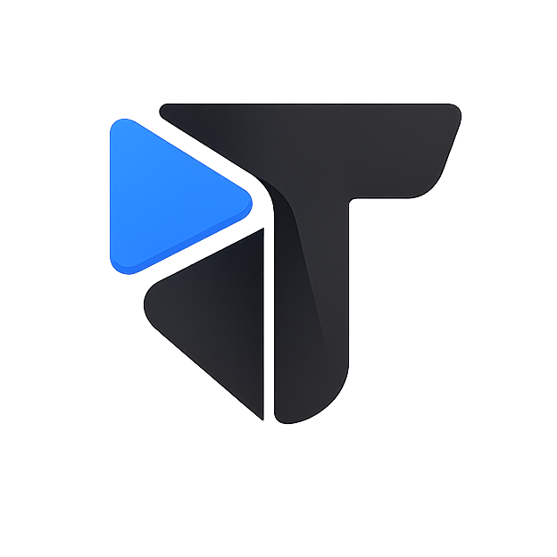

<div align="center">
  
  <h1>Tvizzie</h1>
  <p><strong>A cinematic, modern web platform to discover, track, and review movies & TV shows.</strong></p>

  <p>
    <a href="https://tvizzie.vercel.app"><strong>Live Demo »</strong></a>
  </p>
</div>

---

## ✨ Overview

**Tvizzie** is a refined cinema-inspired media discovery and tracking platform built for film enthusiasts and television lovers. Designed with a dark utility aesthetic, it combines seamless navigation, personal watch diaries, curated custom lists, and rich media metadata.

## 🚀 Key Features

- 🎬 **Media Discovery & Details**: Real-time media feeds, cast & crew filmographies, high-resolution galleries, and trailer previews.
- 📖 **Watch Diary & History**: Log watches, rewatches, and track episode-by-episode progress with a chronological ledger.
- ⭐ **Reviews & Ratings**: Share ratings, write reviews, and explore community consensus.
- 📋 **Curated Custom Lists**: Create, manage, and share personalized collections and watchlists.
- 🔒 **Secure Passwordless Auth**: Seamless authentication powered by Supabase with passkeys, magic links, and OAuth.
- ⚡ **High Performance & Motion**: Powered by Next.js 16, React 19, Framer Motion, and Lenis smooth scrolling.

## 🛠️ Tech Stack

- **Framework**: [Next.js 16](https://nextjs.org/) (App Router) & [React 19](https://react.dev/)
- **Styling**: [Tailwind CSS 4](https://tailwindcss.com/)
- **Backend & Auth**: [Supabase](https://supabase.com/) (SSR, Postgres)
- **Deployment**: [Cloudflare Pages](https://pages.cloudflare.com/) via OpenNext / [Vercel](https://vercel.com/)
- **Animation & UX**: [Framer Motion](https://www.framer.com/motion/) & [Lenis](https://lenis.darkroom.engineering/)
- **Icons & UI Primitives**: [Radix UI](https://www.radix-ui.com/) & [Lucide Icons](https://lucide.dev/)

## 📂 Project Architecture

Tvizzie follows a domain-driven modular architecture:

```
├── app/                  # Next.js App Router (pages, layouts, API routes)
├── domains/              # Feature domains (account, auth, home, media, reviews)
│   ├── account/          # User profiles, collections, diary, settings
│   ├── auth/             # Authentication & session verification
│   ├── home/             # Discovery feeds and landing hero
│   ├── media/            # Movies, TV series, seasons & episodes
│   └── reviews/          # Ratings, reviews & social proof
├── infrastructure/       # Supabase client, networking & caching adapters
├── modules/              # Reusable functional modules (modals, nav, notifications)
├── public/               # Static assets & custom typography
├── shared/               # Shared utilities, contracts & helpers
└── ui/                   # Design system primitives & layout containers
```

Modül teknik referansları: [modules/_docs/README.md](modules/_docs/README.md)

## 🏁 Getting Started

### Prerequisites

- [Node.js](https://nodejs.org/) (v20+ recommended)
- [npm](https://www.npmjs.com/) or `pnpm`

### Installation

1. Clone the repository:
   ```bash
   git clone https://github.com/omerdlw/Tvizzie.git
   cd Tvizzie
   ```

2. Install dependencies:
   ```bash
   npm install
   ```

3. Set up environment variables:
   ```bash
   cp .env.example .env.local
   ```

4. Start the development server:
   ```bash
   npm run dev
   ```

Open [http://localhost:3000](http://localhost:3000) with your browser to explore the app.

## 📜 Scripts

- `npm run dev` — Start Next.js development server with Turbopack.
- `npm run build` — Build standard production Next.js app.
- `npm run build:cloudflare` — Build bundle for Cloudflare OpenNext deployment.
- `npm run lint` — Check code style with ESLint.

---

<div align="center">
  <sub>Built with passion for cinema. © Tvizzie</sub>
</div>
