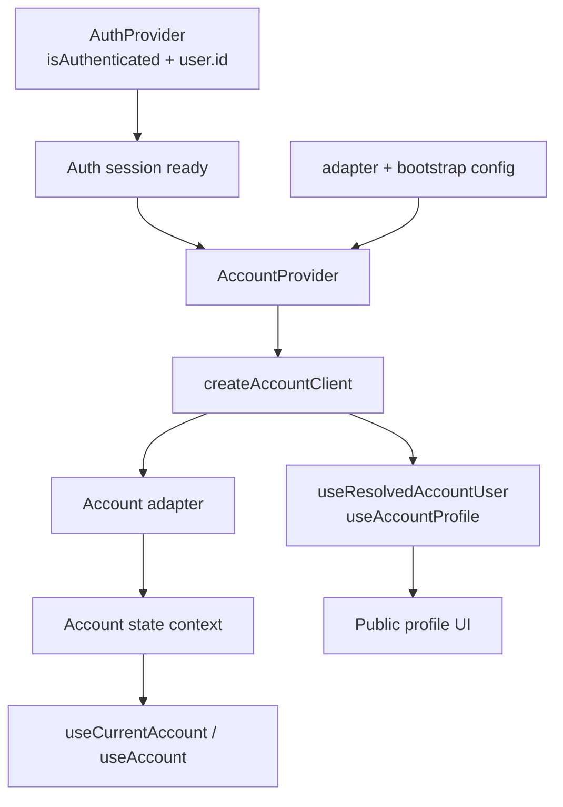
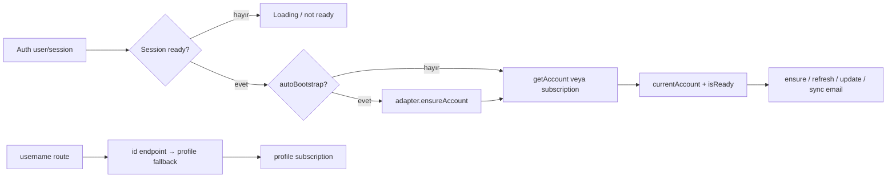

# Account Modülü — Teknik Referans

> **İnceleme tarihi:** 28 Ağustos 2026
>
> `account` modülü, kimliği doğrulanmış kullanıcının hesap kaydını yönetir; username üzerinden public profil çözümleme ve profil aboneliği için aynı adapter sözleşmesini kullanır.

## Hızlı özet

Modül üç katmanı birleştirir:

1. **Adapter/client katmanı:** Hesap veri kaynağını uygulamadan ayırır ve gerekli metodları lazy olarak doğrular.
2. **`AccountProvider`:** Auth oturumu hazır olduktan sonra bootstrap, yükleme, hata ve güncel hesap state'ini context'lere dağıtır.
3. **Profil hook'ları:** `/account/:username` benzeri public rotalarda user id çözümleme ve periyodik profil güncellemesi sağlar.

## İçindekiler

1. [Genel mimari](#1-genel-mimari)
2. [Dosya yapısı ve public API](#2-dosya-yapısı-ve-public-api)
3. [State ve lifecycle](#3-state-ve-lifecycle)
4. [Adapter sözleşmesi](#4-adapter-sözleşmesi)
5. [Profil çözümleme](#5-profil-çözümleme)
6. [Hata ve güvenlik davranışı](#6-hata-ve-güvenlik-davranışı)
7. [Performans ve riskler](#7-performans-ve-riskler)
8. [Developer guide](#8-developer-guide)
9. [Final architecture diagram](#9-final-architecture-diagram)

## 1. Genel mimari

`AccountProvider`, `useAuth` ve `useAuthSessionReady` üzerinden aktif kullanıcıyı belirler. Adapter varsa önce `ensureAccount`, ardından subscription veya `getAccount` ile hesabı doldurur.



Provider adapter olmadan da mount olabilir; `useAccountClient` fallback client üretir, ancak gerçek bir action çağrısı ilgili adapter metodunun yapılandırılmasını bekler.

## 2. Dosya yapısı ve public API

| Dosya | Public export / rol |
| --- | --- |
| `modules/account/index.js` | Provider, state/action hook'ları, client factory'leri ve profil hook'ları için barrel. |
| `modules/account/client.js` | `createAccountAdapter`, `createAccountClient`; adapter metodlarını doğrular ve proxy eder. |
| `modules/account/context.js` | `AccountProvider`, `useAccountConfig`, `useAccountClient`, `useAccountState`, `useAccountActions`, `useCurrentAccount`, `useAccount`. |
| `modules/account/hooks.js` | `useResolvedAccountUser` ve `useAccountProfile`; public/private profil aboneliği. |

### Public adapter metodları

`ensureAccount`, `getAccount`, `getAccountByUsername`, `getAccountIdByUsername`, `primeAccountByUsername`, `searchAccounts`, `subscribeToAccount`, `subscribeToAccountByUsername`, `syncAccountEmail`, `updateAccount` ve `validateUsername` metodları tanınır. `primeAccount` ve `primeAccountByUsername` opsiyoneldir; diğer metodlar kullanıldıkları anda fonksiyon olmalıdır.

## 3. State ve lifecycle

Varsayılan config:

| Alan | Varsayılan | Anlamı |
| --- | --- | --- |
| `autoBootstrap` | `true` | Auth kullanıcı değişiminde `ensureAccount` çağırır. |
| `autoSubscribeCurrentAccount` | `true` | Subscription metodunu tercih eder; yoksa `getAccount` kullanır. |
| `bootstrap.clearPayload` | `null` | Bootstrap payload'ı işlendiğinde opsiyonel temizleme callback'i. |
| `bootstrap.resolvePayload` | `null` | Kullanıcıdan bootstrap payload üretir. |
| `debug` | `false` | Config'te tutulur; provider ayrıca debug log üretmez. |

State alanları:

| Alan | Davranış |
| --- | --- |
| `currentAccount` | En son başarılı account snapshot'ı. |
| `isBootstrapping` | `ensureAccount` çalışırken `true`. |
| `isLoading` | Bootstrap, fetch veya subscription ilk yüklemesinde `true`. |
| `isReady` | Auth hazır ve account akışı sonuçlanmış olduğunda `true`. |
| `error` | Normalize edilmiş `Error`; başarılı action'da temizlenir. |
| `lastUpdatedAt` | State yazımında `Date.now()` ile güncellenir. |

Lifecycle sırası:

1. Auth hazır değilse account action'ı başlamaz.
2. Authenticated kullanıcı için auth session ready değilse account state geçici olarak loading/pending tutulur.
3. `autoBootstrap` açıksa aynı user id için tek kez `ensureAccount` çalışır.
4. Ayrı effect current account subscription'ı başlatır; cleanup'te unsubscribe çağrılır.
5. Kullanıcı anonymous olduğunda bootstrap ref'i sıfırlanır ve state `isReady: true, isLoading: false` olacak şekilde temizlenir.

Görünür pencere için subscription aralığı **3 dakika**, hidden pencere için **15 dakika**dır.

## 4. Adapter sözleşmesi

`createAccountAdapter` input'un object olmasını ve verilen metodların function olmasını doğrular. `createAccountClient` her required metoda ince bir proxy kurar; method yoksa çağrı anında `Account adapter method "…" is not configured` hatası verir. Bu yaklaşım provider'ın test double veya farklı backend adapter'ları ile çalışmasına izin verir.

Başlıca action payload'ları:

- `ensureCurrentAccount(options)`: authenticated auth user ve opsiyonları adapter'a iletir.
- `refreshCurrentAccount()`: `getAccount(user.id)` çağırır.
- `updateCurrentAccount(updates)`: `{ updates, userId }` payload'ı kullanır.
- `syncCurrentAccountEmail(email veya object)`: email değerini `{ email, userId }` biçimine normalize eder.

Her action önce error'ı temizler, sonra başarılı response'u `currentAccount` olarak yazar. Hata `toAccountError` ile normalize edilir, state'e yazılır ve tekrar fırlatılır.

## 5. Profil çözümleme

`useResolvedAccountUser`:

- username yoksa `authUserId` veya server snapshot id'sini kullanır.
- Server snapshot verilmemişse önce `getAccountIdByUsername(username)`, sonuç yoksa `getAccountByUsername(username)` çağırır.
- Async effect cleanup'i `ignore` flag'i ile eski rotanın sonucu yeni state'i ezmesin diye korur.
- Sonuçta `resolvedUserId`, `isResolvingProfile` ve `resolveError` döner.

`useAccountProfile` resolved id'ye göre private kullanıcıda `subscribeToAccount(id)`, public kullanıcıda `subscribeToAccountByUsername(username)` seçer. Başlangıç profili id ile eşleşiyorsa önce state'e alınır ve adapter cache'i `primeAccount*` ile beslenir; subscription `fetchOnSubscribe: false` ile devam eder. Profil yoksa ilk fetch yapılır.

## 6. Hata ve güvenlik davranışı

- Account action'ları authenticated user yoksa başlamadan hata verir.
- Authenticated ama session ready değilse yanlış kullanıcı hesabı yüklenmesini önlemek için action reddedilir.
- Adapter hatası doğrudan kullanıcıya gösterilmeden `Error` instance'ına normalize edilir; `status` ve `data` alanları korunur.
- Public profil çözümlemesi başarısız olursa `Profile not found` fallback'i kullanılır.
- `onError` callback'i ref üzerinden güncel tutulur; callback değişimi subscription'ı gereksiz yere yeniden kurmaz.

## 7. Performans ve riskler

- Provider config, client ve action object'leri memoized'dır; state ve action context'leri ayrıdır.
- Subscription interval'ları browser görünürlüğüne göre backend yükünü azaltır.
- `useResolvedAccountUser` ve `useAccountProfile` stale async sonuçlarını `ignore` flag'iyle engeller.
- `autoBootstrap` ve adapter method eksikleri yanlış yapılandırma için runtime failure noktalarıdır.
- `useAccountClient()` adapter yoksa proxy client döndürdüğü için hata provider mount'ında değil, action çağrısında görülür.
- Aynı kullanıcı için bootstrap ve subscription effect'lerinin backend'de idempotent olması beklenir; bu contract adapter seviyesinde doğrulanmalıdır.

## 8. Developer guide

Provider örneği:

```jsx
<AccountProvider
  config={{
    adapter: accountAdapter,
    autoBootstrap: true,
    autoSubscribeCurrentAccount: true,
  }}
>
  {children}
</AccountProvider>
```

Current account tüketimi:

```jsx
const { currentAccount, isLoading, error, refreshCurrentAccount } = useAccount();
```

Public profile:

```jsx
const { resolvedUserId, isResolvingProfile } = useResolvedAccountUser({
  authUserId: auth.user?.id,
  username,
});
const { profile, hasLoadedProfile } = useAccountProfile({ resolvedUserId, username });
```

Yeni adapter eklerken metod adlarını `client.js` içindeki allowlist'e ekleyin, authenticated user/session-ready guard'ını koruyun ve `subscribeToAccount*` cleanup'inin function döndürdüğünü doğrulayın.

## 9. Final architecture diagram


