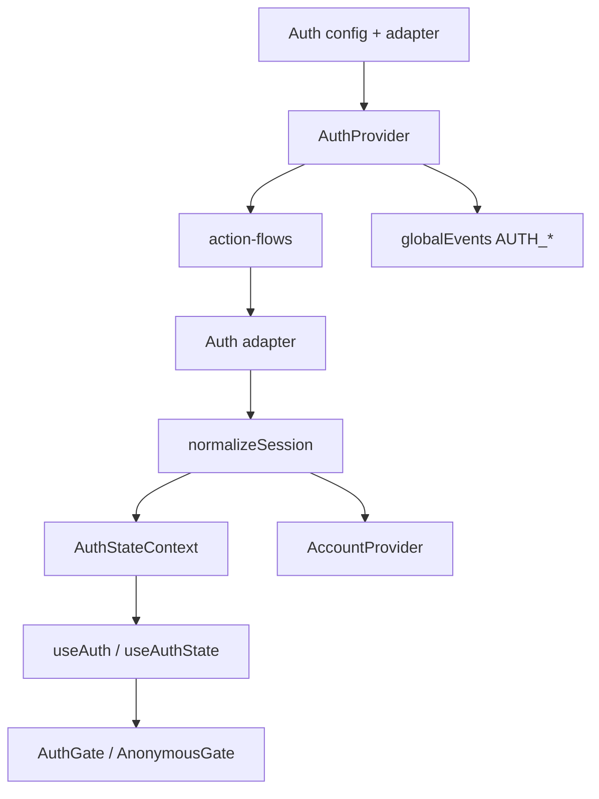
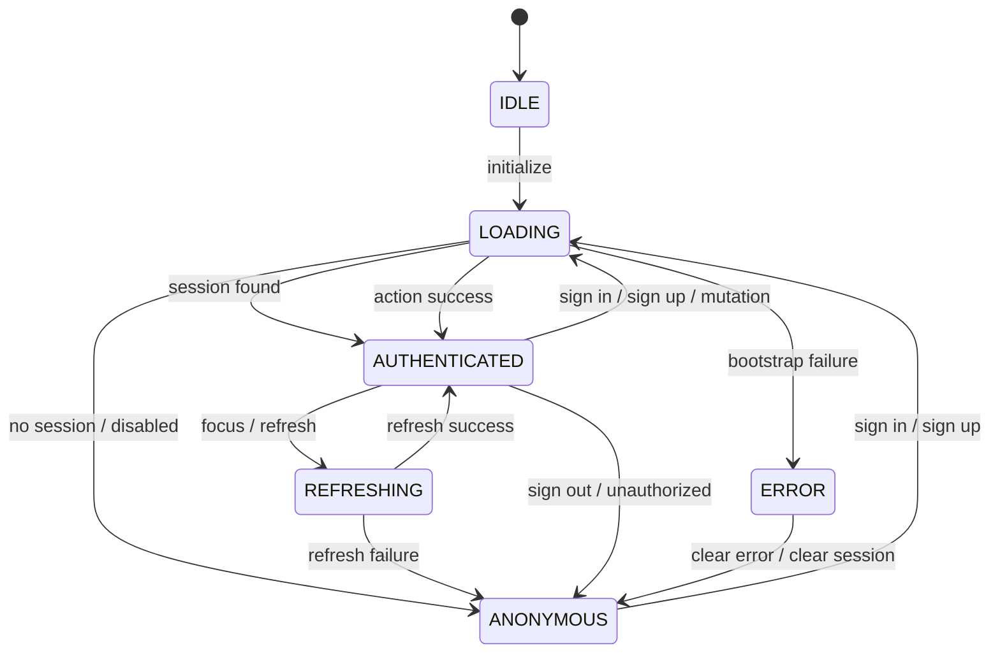

# Auth Modülü — Teknik Referans

> **İnceleme tarihi:** 28 Ağustos 2026
>
> `auth` modülü, oturumun normalize edilmesi, adapter tabanlı kimlik doğrulama akışları, OAuth yönlendirmeleri, passkey/MFA işlemleri ve capability/role tabanlı UI guard'larını tek bir provider altında toplar.

## Hızlı özet

Auth katmanı backend'e doğrudan bağlanan tek bir component değildir. `AuthProvider` state machine'in sahibidir; `action-flows.js` akış orkestrasyonunu; adapter dosyaları Supabase veya başka bir auth backend'ini; `utils.js` ise session/user normalizasyonu ve authorization kurallarını taşır.

Başlıca güvenlik sınırları şunlardır: OAuth `next` path sanitization, session expiry leeway, API unauthorized event'inde session temizleme, adapter method doğrulaması, passkey feature/browser capability kontrolü ve hata akışlarının ortak event'lerle yayınlanması.

## İçindekiler

1. [Genel mimari](#1-genel-mimari)
2. [Dosya yapısı ve public API](#2-dosya-yapısı-ve-public-api)
3. [Config ve state modeli](#3-config-ve-state-modeli)
4. [AuthProvider lifecycle'ı](#4-authprovider-lifecycleı)
5. [Action flow'ları](#5-action-flowları)
6. [Adapter ve provider desteği](#6-adapter-ve-provider-desteği)
7. [Session, storage ve güvenlik](#7-session-storage-ve-güvenlik)
8. [Authorization guard'ları](#8-authorization-guardları)
9. [Performans ve riskler](#9-performans-ve-riskler)
10. [Developer guide](#10-developer-guide)
11. [Final architecture diagram](#11-final-architecture-diagram)

## 1. Genel mimari



Provider action ve state context'lerini ayırır. `useAuth()` ikisini birleştirir ve session üzerinden `can`, `hasRole`, `hasCapability` yardımcılarını ekler.

## 2. Dosya yapısı ve public API

| Dosya | Rol |
| --- | --- |
| `modules/auth/index.js` | Provider, hooks, adapter factory, guard, config ve utility export'ları. |
| `context.js` | `AuthProvider`, `useAuth*` hook'ları, state transition'ları ve event emission. |
| `action-flows.js` | initialize, sign-in/up/out, refresh, profile, reauth ve provider mutation orkestrasyonu. |
| `adapters/create-adapter.js` | Adapter metodlarını normalize/validate eden factory. |
| `adapters/supabase-adapter.js` | Supabase client, API session, OAuth, passkey ve MFA implementasyonu. |
| `config.js` | `AUTH_STATUS`, default config ve default state. |
| `utils.js` | User/session normalization, expiry ve authorization helpers. |
| `provider-utils.js` | GitHub, Google, X, email ve passkey provider çözümleme. |
| `storage.js` | Browser localStorage wrapper. |
| `session-client.js` | Canonical `/api/auth/session` için 1500 ms cache ve in-flight dedupe. |
| `passkeys.js` | Env flag + browser WebAuthn capability kontrolü. |
| `guards.js` | `useAuthorization`, `AuthGate`, `AnonymousGate`. |
| `http.client.js` | Auth API JSON request helper. |
| `session-ready.js` | Beklenen user id ile auth session hazır olma kontrolü. |

### Public action yüzeyi

`initialize`, `signIn`, `signUp`, `signOut`, `refreshSession`, `updateProfile`, `reauthenticate`, `linkProvider`, `unlinkProvider`, `signOutOtherSessions`, `registerPasskey`, `listPasskeys`, `updatePasskey`, `deletePasskey`, `listMfaFactors`, `enrollMfa`, `challengeMfa`, `verifyMfa`, `unenrollMfa`, `getMfaAssuranceLevel` ve `clearError` action context'inden gelir.

## 3. Config ve state modeli

### Default config

| Alan | Varsayılan | Anlamı |
| --- | --- | --- |
| `enabled` | `true` | Auth bootstrap ve action'larını etkinleştirir. |
| `adapter` | `null` | Backend adapter instance'ı. |
| `initialSession` | `null` | Server veya üst katmandan hydration snapshot'ı. |
| `hydrateFromStorage` | `false` | Local storage'dan session okur. |
| `persistSession` | `false` | Normalize session'ı storage'a yazar. |
| `storageKey` | `app_auth_session` | Storage anahtarı. |
| `refreshLeewayMs` | `60000` | Expiry öncesi refresh penceresi. |
| `refreshOnWindowFocus` | `true` | Focus/visibility dönüşünde expired session refresh'i. |
| `clearSessionOnUnauthorized` | `true` | App kaynaklı unauthorized event'inde session'ı temizler. |

### State alanları

`status` şu değerlerden biridir: `idle`, `loading`, `refreshing`, `authenticated`, `anonymous`, `error`. State ayrıca `session`, `user`, `isAuthenticated`, `isReady`, `error` ve `lastUpdatedAt` taşır. `useAuth()` derived olarak `isAnonymous` ve `capabilities` sağlar.

## 4. AuthProvider lifecycle'ı

1. Config merge edilir, storage factory ve adapter/session ref'leri hazırlanır.
2. `initialSession` varsa normalize edilerek başlangıç state'i authenticated yapılır.
3. `initialize()` bir kez çalışır; disabled durumda doğrudan anonymous + `AUTH_READY` event'i yayınlanır.
4. Storage hydration açıksa storage okunur; expiry leeway'i aşılmışsa silent refresh denenir; session yoksa adapter `getSession` çağrılır.
5. Sonuç `applySession` veya `clearSession` ile state'e yazılır ve `AUTH_READY` yayınlanır.
6. Adapter `onAuthStateChange` destekliyorsa session değişimleri dinlenir.
7. `persistSession` açıksa state session'ı storage'a yazılır; session silinince storage temizlenir.

`AUTH_STATUS.LOADING` başlangıç/işlem, `REFRESHING` hazır bir session'ın silent veya normal yenilenmesi, `ERROR` ise normalize edilmiş hata state'idir.

## 5. Action flow'ları

### Sign in

`runAuthSignIn` provider'ı credentials içinden çözer, feedback event'i yayınlar ve adapter `signIn` çağırır. Sonuç `requiresMfa`, `requiresVerification` veya `requiresRedirect` taşıyorsa pending değer olarak döner; mevcut session korunur veya anonymous state'e dönülür. Normal session normalize edilir, state'e uygulanır ve `AUTH_SIGN_IN` event'i yayınlanır.

### Sign up ve profile

`runAuthSignUp` aynı pending-result semantiğini kullanır. `runAuthUpdateProfile`, adapter response'u tam session ise onu; yalnız user patch ise mevcut session ile merge edilmiş session'ı uygular ve user'ı döndürür.

### Refresh ve initialize

Mevcut session varsa adapter `refreshSession`, yoksa `getSession` seçilir. Başarısız refresh session'ı temizler; silent refresh'te hata tekrar fırlatılmaz, normal refresh'te `Session refresh failed` hatası state'e yazılır.

### Sign out

Adapter logout hataları arasında revoke, invalid JWT, timeout ve network kaynaklı beklenen hatalar ignore edilebilir; buna rağmen local session temizlenir. `delete-account` ve `email-change` reason'ları adapter'a `local-purge`, diğerleri `global` mode ile iletilir. `AUTH_SIGN_OUT` ve feedback event'leri ayrıca yayınlanır.

### Provider, passkey ve MFA mutation'ları

Provider mutation'ları (`linkProvider`, `unlinkProvider`, `signOutOtherSessions`) ortak loading/error/session event wrapper'ını kullanır. Passkey ve MFA metodları adapter'da yoksa açık bir unsupported error üretir; adapter exception'ları `setAuthError` ile normalize edilir.

## 6. Adapter ve provider desteği

OAuth provider alias'ları `github`, `github.com`, `google`, `google.com`, `x`, `x.com`, `twitter` ve `twitter.com` olarak normalize edilir. Apple alias'ları disabled kabul edilir. Provider config GitHub, Google ve X için icon/id/key/label; passkey için ayrı config sağlar.

`buildOAuthCallbackUrl` yalnız normalize edilmiş origin, provider, intent (`link`, `sign-in`, `sign-up`) ve sanitize edilmiş next path ile `/api/auth/callback` URL'i üretir. `/sign-in`, `/sign-up`, callback path'leri ve cross-origin URL'ler next hedefi olarak engellenir.

Supabase adapter, client session'ını ve app API session endpoint'ini birlikte kullanır; canonical session payload için ayrı client cache vardır. `createAuthAdapter` ile custom adapter yalnız ihtiyaç duyulan metodları sağlayabilir, ancak çağrılan metodlar function olmalıdır.

## 7. Session, storage ve güvenlik

- `normalizeSession` user id/email/name/avatar, roles, permissions, capabilities, provider, metadata ve expiry alanlarını tek şekle getirir.
- `isSessionExpired(session, leewayMs)` expiry zamanını `Date.now() + leewayMs` ile karşılaştırır.
- `canAccess` auth zorunluluğunu, role'leri ve capability/permission listesini `requireAll` ile değerlendirir.
- Storage JSON parse edilemezse değer silinir ve `null` döner.
- Canonical session fetch 1500 ms TTL ve aynı anda tek in-flight promise ile tekrar eden istekleri birleştirir.
- `API_UNAUTHORIZED` app kaynaklıysa varsayılan olarak session temizlenir ve sign-out event'i yayınlanır.

## 8. Authorization guard'ları

```jsx
<AuthGate
  roles={["admin"]}
  capabilities={["lists:write"]}
  loadingFallback={<Spinner />}
  fallback={<AccessDenied />}
>
  <AdminPanel />
</AuthGate>
```

`useAuthorization(rules)` `isPending`, `isAllowed`, `isAuthenticated`, `isAnonymous`, `can` ve auth object'ini döndürür. Pending durumuna idle/loading/refreshing ve `isReady=false` dahildir. `AnonymousGate` authenticated kullanıcıyı fallback'e gönderir; anonymous kullanıcıda children'ı render eder.

## 9. Performans ve riskler

- Action flow'ları context'ten ayrıldığı için ortak state transition'ları tek yerde kalır.
- Session ref'i event handler ve focus refresh callback'lerinde stale closure riskini azaltır.
- Canonical session cache ve in-flight dedupe network yükünü sınırlar.
- `persistSession`/`hydrateFromStorage` false default'tur; güvenlik ve UX kararı bilinçli verilmelidir.
- `clearSessionOnUnauthorized` yalnız `source: app` veya source olmayan event'leri kabul eder; dış kaynak event'leri ignore edilir.
- OAuth callback URL'inde origin ve next path doğrulaması korunmalıdır; yeni provider eklerken alias/redirect allowlist birlikte güncellenmelidir.
- Adapter method eksikleri runtime'da görünür; production config validation katmanı eklemek teşhis süresini azaltabilir.

## 10. Developer guide

```jsx
<AuthProvider
  config={{
    adapter: authAdapter,
    initialSession,
    refreshOnWindowFocus: true,
    refreshLeewayMs: 60_000,
    persistSession: false,
  }}
>
  {children}
</AuthProvider>
```

```jsx
const { user, isAuthenticated, signIn, signOut, hasCapability } = useAuth();
await signIn({ email, password });
```

Passkey UI için hem `isPasskeyFeatureEnabled()` env flag'ini hem `usePasskeySupport()` browser sonucunu kontrol edin. Yeni auth action'ı eklerken action-flow, context fallback action, event/error semantiği, adapter contract ve public barrel'ın birlikte güncellenmesi gerekir.

## 11. Final architecture diagram


