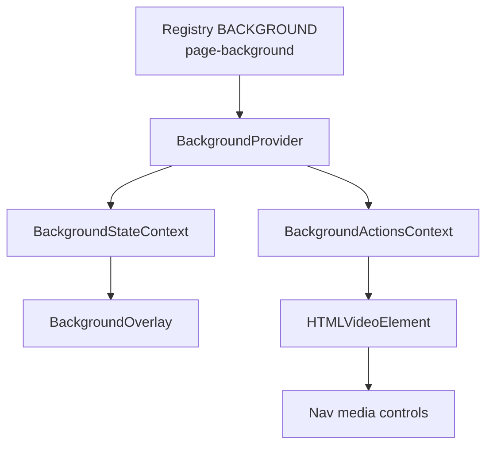
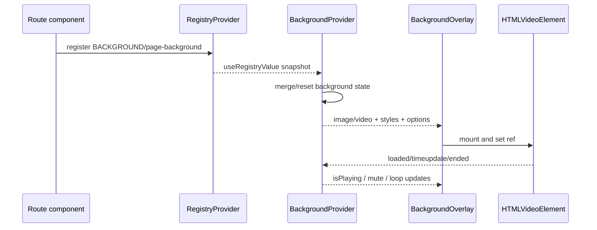

# Background Modülü — Teknik Referans

> **İnceleme tarihi:** 28 Ağustos 2026
>
> `background` modülü, registry üzerinden gelen sayfa arka planını image/video olarak render eder ve oynatma kontrolünü React context'i üzerinden yönetir.

## Hızlı özet

Modülün merkezi `BackgroundProvider`'dır. `page-background` registry kaydı değiştiğinde background state'i yeni kaynakla merge edilir; `BackgroundOverlay` bunu `document` üzerinde fixed, pointer-events kapalı bir Motion katmanı olarak gösterir. Video aktif olduğunda element ref'i context'e bağlanır ve Nav medya kontrolleri aynı ref üzerinden oynatma, mute, loop ve seek davranışını kullanabilir.

## İçindekiler

1. [Mimari ve dosyalar](#1-mimari-ve-dosyalar)
2. [State modeli](#2-state-modeli)
3. [Registry entegrasyonu](#3-registry-entegrasyonu)
4. [Image ve video pipeline](#4-image-ve-video-pipeline)
5. [Oynatma lifecycle'ı](#5-oynatma-lifecycleı)
6. [Animasyon ve stil](#6-animasyon-ve-stil)
7. [Performans ve riskler](#7-performans-ve-riskler)
8. [Developer guide](#8-developer-guide)
9. [Final diagram](#9-final-diagram)

## 1. Mimari ve dosyalar

| Dosya | Rol |
| --- | --- |
| `modules/background/context.js` | `BackgroundProvider`, state/action context'leri, registry sync ve state merge. |
| `modules/background/index.js` | `BackgroundOverlay`, image/video DOM, Framer Motion geçişleri ve playback event'leri. |
| `modules/background/index.js` public API | `BackgroundProvider`, `useBackgroundState`, `BackgroundOverlay`; `useBackgroundActions` ve `useOptionalBackgroundActions` için `modules/background/context.js` import edilir. |



## 2. State modeli

Varsayılanlar:

| Alan | Varsayılan / anlam |
| --- | --- |
| `image`, `video` | `null`; aynı anda biri tercih edilir. |
| `isPlaying` | `false`. |
| `videoOptions` | `playbackRate: 1`, `autoplay: true`, `muted: true`, `loop: false`, `corp: 0`. |
| `overlayOpacity` | `0`; `overlayColor: var(--black)`. |
| `position` | `center`. |
| `overlay` | `false`. |
| `imageStyle`, `videoStyle`, `noiseStyle` | Boş object. |
| `animation` | `null`. |

State selector'ları ayrıca `hasBackground` ve `isVideo` derived alanlarını üretir. Action API:

- `setBackground(patch)`: image/style/video option/animation alanlarını deep-ish merge eder.
- `setVideoPlaying`, `setVideoElement`: oynatma state'i ve gerçek element ref'ini bağlar.
- `toggleVideo`, `toggleMute`, `toggleLoop`: video kontrolü.
- `resetBackground`: default state'e döner.
- `useOptionalBackgroundActions`: Provider dışındaki güvenli tüketim için null dönebilen hook.

Image değişirken TMDB `w###`, `h###` veya `original` varyantı `original` URL'sine normalize edilir.

## 3. Registry entegrasyonu

Provider `REGISTRY_TYPES.BACKGROUND` altında `page-background` key'ini izler. Registry kaydı yoksa state resetlenir. Yeni kaynak aynı image/video ise mevcut runtime state merge edilir; kaynak değiştiğinde default state'ten başlanır. Böylece route değişirken eski video kontrol alanları yeni medyaya sızmaz.

```jsx
useRegistry({
  background: {
    image: posterUrl,
    overlay: true,
    overlayOpacity: 0.35,
    imageStyle: { backgroundPosition: 'center' },
  },
});
```

## 4. Image ve video pipeline

`BackgroundOverlay`:

1. `hasBackground` false ise hiçbir DOM üretmez.
2. Video varsa `video` key'i, image varsa `image` key'i ile `AnimatePresence` source geçişini ayırır.
3. Video için `object-cover`, `preload="auto"`, `muted`, `loop`, `playsInline` ve MP4/WebM source fallback'leri kullanır.
4. Image için fixed div ve `backgroundImage`/`backgroundPosition` kullanır.
5. `leftGradient` ve `rightGradient` değerleri kadar black gradient katmanı ekler.
6. Noise texture katmanını `mixBlendMode` ve opacity ile uygular.
7. `overlay` açıksa renk/opaklık transition'ı ekler.

Tüm katman fixed ve pointer-events kapalıdır; uygulama içi etkileşimi bloke etmez.

## 5. Oynatma lifecycle'ı

- Video mount olduğunda ref context'e yazılır.
- `isPlaying`, mute veya playback rate değiştiğinde `applyVideoPlaybackState` çalışır.
- Pause durumunda video durdurulur; play promise'i reject olursa warning yazılır ve `setVideoPlaying(false)` çağrılır.
- `onLoadedData`, muted + autoplay ise tekrar play dener; browser autoplay politikasına uyulmazsa yalnız warning üretir.
- `onEnded`, loop açıksa zamanı sıfırlayıp yeniden oynatır; değilse pause edip `isPlaying=false` yapar.
- `corp > 0` ise `currentTime >= duration - corp` eşiğinde ended davranışı tetiklenir.
- Component cleanup'te `videoElement` null'a çekilir.

`toggleMute` sesi açarken videonun durmuş olmasını engellemek için `isPlaying` değerini true yapar; `toggleLoop` ayrıca gerçek elementin `loop` property'sini günceller.

## 6. Animasyon ve stil

`animation` içinden `initial`, `animate`, `exit`, `transition` ve `exitDurationFactor` alınır. Varsayılan geçiş opacity için `0.6s` ve `[0.4, 0, 0.2, 1]` easing'dir. Exit süresi varsayılan olarak transition süresinin `0.6` katsayısıdır.

Video/image source değişiminde Motion `AnimatePresence mode="sync"` kullanılır. Bu, eski ve yeni arka planın geçişte kısa süre birlikte bulunmasına izin verir. `willChange: transform, opacity, filter` ve `transform-gpu` render maliyetini azaltmayı hedefler.

## 7. Performans ve riskler

- Background tek fixed layer'da tutulur; overlay ve noise pointer-events kapalıdır.
- `setBackground` style gruplarını ayrı merge ettiği için kısmi patch'ler önceki style alanlarını korur.
- `video.play()` async olduğu için autoplay ve user gesture farklılıkları beklenen davranıştır.
- Büyük video `preload="auto"` kullandığından route başına ağır medya maliyeti oluşabilir.
- `leftGradient`/`rightGradient` yüksek değerlerde gereksiz katman çoğaltır; bu alan için üst sınır yoktur.
- `videoElement` DOM ref'i state/context'te tutulur; provider scope'u ile component lifecycle'ının aynı olduğundan emin olunmalıdır.

## 8. Developer guide

Video kaydı:

```jsx
useRegistry({
  nav: { path: '/trailer', title: 'Trailer' },
  background: {
    video: '/media/trailer.mp4',
    videoOptions: { autoplay: true, muted: true, loop: true, playbackRate: 1 },
    videoStyle: { filter: 'brightness(0.72)' },
  },
});
```

Imperative kontrol:

```jsx
const { isVideo, isPlaying } = useBackgroundState();
const { toggleVideo, toggleMute, toggleLoop } = useBackgroundActions();
```

Yeni background alanı eklerken default state, `mergeBackgroundState`, state selector'ı ve overlay render kolunu birlikte güncelleyin. Media controller ile ortak kullanılacaksa `videoElement` lifecycle'ını bozmayın.

## 9. Final diagram


