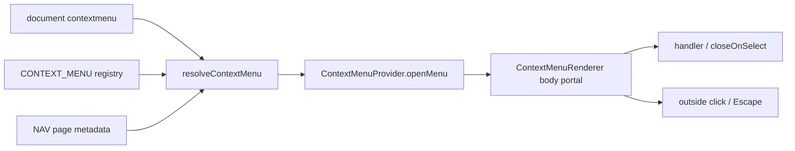

# Context Menu Modülü — Teknik Referans

> **İnceleme tarihi:** 28 Ağustos 2026
>
> `context-menu` modülü, document seviyesindeki sağ tık olayını registry menüleri ile eşleştirir; rota, hedef element, priority ve koşullara göre tek bir menü seçer ve body portalında klavye erişimli olarak render eder.

## Hızlı özet

Akış dört parçalıdır:

1. `useContextMenuListener` registry adaylarını ve aktif Nav metadata'sını alır.
2. `resolveContextMenu` path/target/when/enabled/priority skorlamasıyla kazanan config'i seçer.
3. `ContextMenuProvider` açık menünün config, context, item listesi ve koordinatını taşır.
4. `ContextMenuRenderer` fixed portal, header, action item'ları, focus ve dismissal davranışını render eder.

## İçindekiler

1. [Dosya yapısı](#1-dosya-yapısı)
2. [Registry ve aday seçimi](#2-registry-ve-aday-seçimi)
3. [Menu config sözleşmesi](#3-menu-config-sözleşmesi)
4. [Item çözümleme](#4-item-çözümleme)
5. [State ve lifecycle](#5-state-ve-lifecycle)
6. [Render, konum ve erişilebilirlik](#6-render-konum-ve-erişilebilirlik)
7. [Animasyon, performans ve riskler](#7-animasyon-performans-ve-riskler)
8. [Developer guide](#8-developer-guide)
9. [Final diagram](#9-final-diagram)

## 1. Dosya yapısı

| Dosya | Rol |
| --- | --- |
| `menu-engine.js` | Candidate normalize, path/target score, context ve item resolution. |
| `context.js` | `ContextMenuProvider`, `useContextMenu`, open/close state. |
| `index.js` | Global document listener, Nav page metadata merge ve public barrel. |
| `renderer.js` | Portal menü, header/item render, focus, keyboard, scroll lock. |
| `motion.js` | Pop/content/item transition ve micro tap token'ları. |

## 2. Registry ve aday seçimi

Registry `CONTEXT_MENU` entry'leri key'e göre tutulur. Bir entry doğrudan `items` taşıyabilir veya `menus` array'i ile birden fazla aday üretebilir. Shared config her nested menu ile merge edilir; shared ve menu `classNames` alanları da birleştirilir.

`resolveContextMenu` her adayı şu sırayla eler:

- path/pathnames/pathMatcher eşleşmiyor;
- `enabled` veya `when` false;
- çözümlenmiş item listesi boş;
- target selector verilmiş ama event target eşleşmiyor.

Kazanan skor:

```text
score = priority * 10000 + routeScore * 100 + targetScore
```

Route score exact path/registry key için 100, current-page için 70, global `*` için 40, diğer adaylar için 10'dur. Target selector eşleşmesinde element derinliği azaldıkça score artar. Eşitlikte registry insertion order kazanır.

## 3. Menu config sözleşmesi

Desteklenen alanlar:

| Alan | Anlam |
| --- | --- |
| `path` | Tek pathname eşleşmesi. |
| `paths` / `pathnames` | Pathname allowlist'i. |
| `pathMatcher` | `(pathname) => boolean` matcher. |
| `target` | `closest()` ile kontrol edilen CSS selector veya selector listesi. |
| `priority` | Aday seçim ağırlığı. |
| `enabled` | Boolean veya context alan function'ı. |
| `when` | `(event, { pathname, target, context }) => boolean`. |
| `payload` | Context'e taşınan sabit payload. |
| `resolvePayload` | Event/context'ten dinamik payload. |
| `resolveContext` | Ek context alanları. |
| `onOpen` | Açılmadan önce çağrılır; `false` sonucu opening'i iptal eder. |
| `header` | Header config/function; `false` header'ı kapatır. |
| `items` | Item array'i veya context alan function'ı. |
| `onClose` | Provider close sırasında context ile çağrılır. |

Event context `event`, `currentTarget`, `pathname`, `point: { x, y }`, `target` ve payload taşır. Listener ayrıca aktif Nav item'ından `page` metadata'sı ekler; title/description/icon için context menu override'ları önceliklidir.

## 4. Item çözümleme

Her item `label` olmadan render edilmez. `label`, `icon`, `shortcut`, `className`, `visible`, `hidden`, `disabled`, `danger` ve handler alanları sabit değer veya context function olabilir. `onSelect` önceliklidir; yoksa `onClick` handler olarak kullanılır.

`separator` item'ları normalize edilir, ardışık separator'lar sıkıştırılır ve listenin sonundaki separator kaldırılır. Action item'ları `type: action`, `key`, `label`, `closeOnSelect` ve normalize edilmiş handler taşır.

```js
{
  label: 'Add to list',
  icon: 'solar:list-bold',
  shortcut: 'L',
  visible: ({ payload }) => Boolean(payload?.mediaId),
  onSelect: (_event, context) => openListPicker(context.payload.mediaId),
}
```

## 5. State ve lifecycle

Provider state'i `config`, `context`, `isOpen`, `items` ve `{ x, y }` position alanlarından oluşur. `openMenu` hem doğrudan config/koordinat hem de önceden resolve edilmiş `{ config, context, items, position }` state kabul eder.

Listener lifecycle:

1. Capture phase'de document `contextmenu` event'i dinlenir.
2. Kazanan varsa event preventDefault/stopPropagation yapılır.
3. `onOpen` çağrılır; false ise menu açılmaz.
4. Items yeniden çözülür; boş liste ise açılmaz.
5. Provider state'e yazılır, visibility custom event'i yayınlanır.
6. Seçim, dış click veya Escape ile `closeMenu`; `onClose` bir kez çağrılır.

## 6. Render, konum ve erişilebilirlik

Renderer `document.body` portalı kullanır. Menü fixed konumlanır ve viewport kenarlarından minimum 10 px margin korunacak şekilde `positionMenu` ile içeri çekilir. Overlay ayrı bir fixed katmandır.

Menü `role="menu"`, item'lar `role="menuitem"` ve disabled action'lar `aria-disabled` taşır. Açılışta container focus alır; ArrowUp/ArrowDown yalnız enabled action'lar arasında dolaşır; Enter/Space seçer; Escape kapatır.

Menü açıkken wheel, touchmove ve dış scroll tuşları capture phase'de prevent edilir. Dış mousedown ve Escape kapanış tetikler. `[data-context-menu-ignore]`, `[data-context-menu-overlay]` ve mevcut `[role="menu"]` target çözümlemesinde dışlanır.

## 7. Animasyon, performans ve riskler

- Pop transition `0.2s` opacity/scale/y; içerik `0.34s`, item'lar index bazlı en fazla yaklaşık `0.21s` stagger delay kullanır.
- Candidate resolution menü sayısı düşük varsayımıyla her contextmenu event'inde yapılır; global registry büyürse target/path indeksleme düşünülebilir.
- Function config hataları güvenli fallback ile false/undefined döner; handler hataları console'a yazılır ve menü akışı bozulmaz.
- `onOpen` yan etkisi item resolution'dan önce çalışır; callback idempotent olmalıdır.
- `closeOnSelect: false` action handler'ın menüyü açık bırakmasına izin verir; uzun async işlemlerde close kararını caller vermelidir.
- `elementsFromPoint` desteği olmayan veya custom overlay içeren tarayıcı durumları initial target fallback'ine döner.

## 8. Developer guide

Declarative registry kaydı:

```jsx
useRegistry({
  contextMenu: {
    priority: 20,
    target: '[data-media-card]',
    items: ({ payload }) => [
      { label: 'Open', onSelect: () => openMedia(payload.id) },
      'separator',
      { label: 'Delete', danger: true, disabled: !payload.canDelete, onSelect: deleteMedia },
    ],
    resolvePayload: (_event, context) => ({ id: context.target?.dataset.mediaId }),
  },
});
```

Global montaj için `ContextMenuProvider` üst tree'de, `ContextMenuGlobal` ise listener + renderer olarak bir kez mount edilmelidir. Yeni item alanı eklerken `normalizeMenuItem`, keyboard selection ve renderer görünümünü beraber güncelleyin.

## 9. Final diagram


