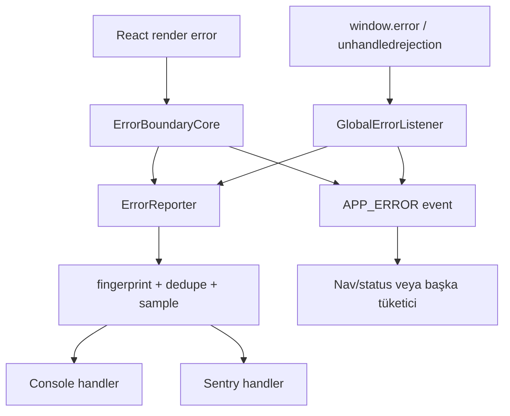

# Error Boundary Modülü — Teknik Referans

> **İnceleme tarihi:** 28 Ağustos 2026
>
> `error-boundary` modülü, React render hatalarını fallback UI ile sınırlar; browser seviyesindeki error/unhandled rejection olaylarını throttle/dedupe ederek ortak event bus ve opsiyonel reporter handler'larına taşır.

## Hızlı özet

Modül iki hata kanalını birleştirir:

1. **Render kanalı:** `ErrorBoundaryCore` ve `GlobalError`, `ModuleError`, `ComponentError` wrapper'ları.
2. **Runtime kanalı:** `GlobalErrorListener`, `window.error` ve `unhandledrejection` dinleyicileri.

`ErrorReporter` rapora fingerprint, route, user agent, component stack ve custom context ekler; console veya Sentry gibi handler'lara gönderir.

## İçindekiler

1. [Dosya yapısı ve public API](#1-dosya-yapısı-ve-public-api)
2. [React boundary davranışı](#2-react-boundary-davranışı)
3. [Hata context'i](#3-hata-contexti)
4. [Global runtime listener](#4-global-runtime-listener)
5. [Reporter pipeline](#5-reporter-pipeline)
6. [Integrations](#6-integrations)
7. [Performans ve riskler](#7-performans-ve-riskler)
8. [Developer guide](#8-developer-guide)
9. [Final diagram](#9-final-diagram)

## 1. Dosya yapısı ve public API

| Dosya | Rol |
| --- | --- |
| `core.js` | `ErrorBoundaryCore`, reset, fallback render, event/report emission. |
| `index.js` | `GlobalError`, `ModuleError`, `ComponentError` wrapper'ları ve public export'lar. |
| `listener.js` | Global browser error/rejection listener, ignore/throttle/max count. |
| `reporter.js` | Singleton `ErrorReporter`, report shape, sample/dedupe/beforeSend. |
| `integrations.js` | `createConsoleHandler` ve `createSentryHandler`. |

## 2. React boundary davranışı

`ErrorBoundaryCore` class component'tir. `getDerivedStateFromError` `hasError` state'ini açar; `componentDidCatch` errorInfo'yu saklar ve raporlama yan etkilerini çalıştırır. `resetKey` değiştiğinde `getDerivedStateFromProps` boundary'yi otomatik sıfırlar.

Wrapper'lar:

| Wrapper | Başlık / reset key | Kullanım |
| --- | --- | --- |
| `GlobalError` | `Application Error`, pathname reset key'i | Route seviyesinde tüm uygulama alanı. |
| `ModuleError` | `${name} Error` veya `Module Error` | Nav/modal gibi bir modülün render sınırı. |
| `ComponentError` | Inline component failure mesajı | Küçük bir UI parçası. |

Fallback verilmezse error tone'lu panel, mesaj ve `Try Again` Button render edilir. Fallback function ise `{ resetError, error }` alır. `onReset` reset sonrası çağrılır.

## 3. Hata context'i

`createErrorContext` şu alanları üretir:

`componentStack`, `route`, `userAgent`, ISO `timestamp`, `name`, `variant` ve `source: ErrorBoundary`.

Boundary catch sırasında:

1. `onError(error, errorInfo, context)` callback'i çağrılır.
2. `silent` değilse `EVENT_TYPES.APP_ERROR` emit edilir; payload `resetError` içerir.
3. Reporter'da handler varsa `captureError(error, context)` çalışır.
4. Development ortamında console error yazılır.

## 4. Global runtime listener

`GlobalErrorListener` window `error` ve `unhandledrejection` event'lerini dinler. Aşağıdaki hatalar ignore edilir: ResizeObserver loop, network request failed, loading chunk, unexpected end of input, failed to fetch, script error ve 404/not-found sonuçları.

Koruma limitleri:

- Aynı listener içinde iki saniyelik throttle.
- Listener başına en fazla 10 hata.
- Aynı normalized message yalnızca bir kez gösterilir.
- Reporter'a source olarak `window.onerror` veya `unhandledrejection`, ayrıca `globalListener: true` verilir.
- Sonra `APP_ERROR` event'i yayınlanır.

Bu listener UI render etmez; Nav veya başka bir tüketici `APP_ERROR` event'ini kendi status yüzeyine çevirebilir.

## 5. Reporter pipeline

`getErrorReporter(options)` process-wide singleton döndürür. İlk çağrıdaki options saklanır.

```text
captureError
  → enabled kontrolü
  → sampleRate kontrolü
  → global + extra context merge
  → fingerprint üretimi
  → dedupe window kontrolü
  → beforeSend(report)
  → registered handlers
```

Report; error message/stack/name, fingerprint, timestamp, browser environment, component stack, context ve tags taşır. Context en fazla 10 key ile sınırlandırılır; fingerprint cache'i en fazla 100 kayıt tutar ve default dedupe window 60 saniyedir. `captureMessage` mesajı synthetic Error olarak aynı pipeline'a sokar.

## 6. Integrations

`createConsoleHandler({ level, expanded })` compact log veya `console.group` formatı üretir. `createSentryHandler(Sentry)` geçerli bir `captureException` API'si yoksa console handler fallback'ine döner; geçerliyse fingerprint, user, tags, environment, custom context ve component stack'i Sentry scope'una aktarır.

```js
const reporter = getErrorReporter({ sampleRate: 0.5, deduplicateWindow: 30_000 });
reporter.addHandler(createConsoleHandler({ expanded: true }));
reporter.setTag('release', buildId);
reporter.setContext('feature', 'navigation');
```

## 7. Performans ve riskler

- Boundary fallback'i yalnız render hatasında görünür; sağlıklı ağaçta ek UI üretmez.
- Reporter sampling, fingerprint dedupe ve bounded sets rapor gürültüsünü sınırlar.
- Handler hataları ana uygulama hatasını tekrar üretmemek için yakalanır.
- Singleton reporter testler arasında state taşıyabilir; handler ve dedupe temizliği için test izolasyonu gerekir.
- `beforeSend` raporu null döndürerek iptal edebilir; callback'in hassas verileri filtrelemesi beklenir.
- Global listener aynı mesajları suppress eder; farklı context taşıyan aynı mesajlar ayrı raporlanmayabilir.
- Default fallback `error.message` render eder; production'da backend hassasiyetine göre wrapper fallback'i veya redaction tercih edilmelidir.

## 8. Developer guide

```jsx
<ModuleError name="Profile">
  <ProfilePanel />
</ModuleError>
```

```jsx
<ComponentError fallback={({ resetError }) => <RetryCard onRetry={resetError} />}>
  <RemoteWidget />
</ComponentError>
```

Yeni bir boundary variant'ı eklerken `createErrorContext` variant değerini, default fallback mesajını ve ilgili global event tüketicilerini güncelleyin. Sentry entegrasyonunda SDK'yı module import zamanı değil, handler oluşturulurken geçirin.

## 9. Final diagram


