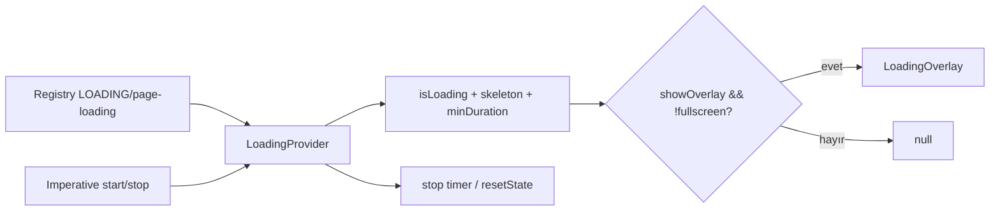

# Loading Modülü — Teknik Referans

> **İnceleme tarihi:** 28 Ağustos 2026
>
> `loading` modülü, route veya feature loading bilgisini registry'den alıp minimum gösterim süresi olan ortak bir loading state ve fullscreen-aware overlay'e dönüştürür.

## Hızlı özet

`LoadingProvider`, `page-loading` registry kaydını izler. `startLoading` ile skeleton, overlay görünürlüğü ve minimum süre tutulur; `stopLoading` minimum süre dolmadan state'i kapatmaz. `LoadingOverlay`, loading açık olsa bile fullscreen feedback state aktifse görünmez.

## İçindekiler

1. [Dosyalar ve public API](#1-dosyalar-ve-public-api)
2. [State modeli](#2-state-modeli)
3. [Lifecycle ve minimum süre](#3-lifecycle-ve-minimum-süre)
4. [Registry entegrasyonu](#4-registry-entegrasyonu)
5. [Render davranışı](#5-render-davranışı)
6. [Performans ve riskler](#6-performans-ve-riskler)
7. [Developer guide](#7-developer-guide)
8. [Final diagram](#8-final-diagram)

## 1. Dosyalar ve public API

| Dosya | Rol |
| --- | --- |
| `modules/loading/context.js` | `LoadingProvider`, `useLoadingState`, `useLoadingActions`, registry sync. |
| `modules/loading/index.js` | `LoadingOverlay`, `LoadingContent`, public barrel. |

Public action'lar `startLoading(options)`, `stopLoading()`, `setIsLoading(value)`, `setLoading(value)` ve `setSkeleton(skeleton)`'dır.

## 2. State modeli

| Alan | Anlam |
| --- | --- |
| `isLoading` / `isPageLoading` | Ortak loading flag'i; iki isim aynı değeri taşır. |
| `skeleton` | Varsa Spinner yerine render edilecek React node. |
| `minDuration` | Aktif loading'in minimum ms süresi. |
| `showOverlay` | Fullscreen overlay gösterme izni. |

`normalizeLoadingOptions` süreyi pozitif finite number'a çevirir; geçersiz değer `0`, `showOverlay` default `true`, skeleton default `null` olur.

## 3. Lifecycle ve minimum süre

`startLoading` mevcut stop timer'ını iptal eder, başlangıç zamanını kaydeder ve options'ı state'e yazar. `stopLoading`:

- start zamanı yoksa veya minimum süre `0` ise hemen resetler;
- elapsed süre minimumdan küçükse kalan süre kadar timer kurar;
- süre dolmuşsa hemen resetler.

`resetState` timer'ı temizler, skeleton/minDuration'ı sıfırlar, overlay'i tekrar görünür varsayılanına getirir. Provider unmount'ta aktif timer temizlenir.

## 4. Registry entegrasyonu

`useRegistryValue(REGISTRY_TYPES.LOADING, 'page-loading')` izlenir. Registry'de `isLoading` truthy ise registry options ile `startLoading`, falsy ise `stopLoading` çağrılır. Declarative kullanım:

```jsx
useRegistry({
  loading: {
    isLoading: true,
    minDuration: 450,
    showOverlay: true,
    skeleton: <PageSkeleton />,
  },
});
```

Registry `loading` plugin'inin default cleanup gecikmesi 600 ms olduğundan hızlı route geçişlerinde overlay'in anlık titremesi azaltılır.

## 5. Render davranışı

`LoadingOverlay` görünürlük koşulu:

```text
isLoading && showOverlay && !isFullscreenStateActive
```

Skeleton verilmişse doğrudan render edilir; aksi halde `Spinner size={50}` kullanılır. Overlay `fixed inset-0` ve merkezi hizalıdır. Component görünmediğinde `null` döner; gereksiz portal veya DOM katmanı oluşturmaz.

## 6. Performans ve riskler

- State/action context'leri ayrıdır ve provider değerleri memoized'dır.
- Stop timer tek ref'te tutulduğu için yeni start eski kapanış timer'ını iptal eder.
- Registry cleanup delay, loading config lifecycle'ı ile timer lifecycle'ının birlikte düşünülmesini gerektirir.
- `startLoading` art arda çağrılırsa minimum süre her çağrıda yeniden başlar; uzun süren işlerde caller tek bir owner olmalıdır.
- Fullscreen state loading overlay'i saklayabilir; kullanıcı geri dönüşünde loading state'in hâlâ doğru tutulduğundan emin olunmalıdır.

## 7. Developer guide

Imperative kullanım:

```jsx
const { startLoading, stopLoading } = useLoadingActions();

startLoading({ minDuration: 300, skeleton: <ListSkeleton /> });
try {
  await loadData();
} finally {
  stopLoading();
}
```

Yeni loading görseli eklemek için `LoadingContent` fallback'ini veya registry'deki `skeleton` değerini kullanın. Minimum süre ihtiyacı yoksa `minDuration` vermeyin; stop çağrısı doğrudan state'i kapatır.

## 8. Final diagram


