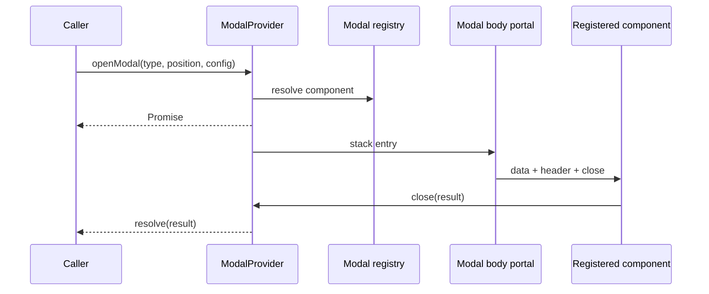

# Modal Modülü — Teknik Referans

> **İnceleme tarihi:** 28 Ağustos 2026
>
> `modal` modülü, registry'de kayıtlı modal component'lerini Promise sonucu olan bir stack olarak body portalına render eder; center/edge position, responsive position, focus trap, scroll lock ve ortak chrome sağlar.

## Hızlı özet

`ModalProvider` modal stack ve resolver map'lerinin sahibidir. `openModal` config'i normalize edip registry component'i için entry oluşturur ve Promise döner. `Modal` top entry'yi portalda render eder; top olmayan layer'lar inert overlay ile kapatılır. `Container` header/body/footer anatomisini, header resolver'ları domain metadata'sını ve `motion.js` geçişleri taşır.

## İçindekiler

1. [Dosyalar ve public API](#1-dosyalar-ve-public-api)
2. [Config ve position modeli](#2-config-ve-position-modeli)
3. [Modal stack ve Promise lifecycle](#3-modal-stack-ve-promise-lifecycle)
4. [Registry entegrasyonu](#4-registry-entegrasyonu)
5. [Portal, focus ve scroll lock](#5-portal-focus-ve-scroll-lock)
6. [Container ve header contract'ı](#6-container-ve-header-contractı)
7. [Animasyon](#7-animasyon)
8. [Performans ve riskler](#8-performans-ve-riskler)
9. [Developer guide](#9-developer-guide)
10. [Final diagram](#10-final-diagram)

## 1. Dosyalar ve public API

| Dosya | Rol |
| --- | --- |
| `context.js` | `ModalProvider`, `useModal`, `useModalActions`, `useModalState`, stack/resolver lifecycle. |
| `index.js` | `Modal`, portal layer, backdrop, responsive viewport, focus trap. |
| `container.js` | `Container`/`ModalContainer`, header/footer/body slot'ları ve action class'ları. |
| `header.js` | Modal type'a göre fallback title/action resolver'ları. |
| `config.js` | Position, chrome, breakpoint, preset ve label sabitleri. |
| `motion.js` | Position variant'ları, backdrop, content/list ve micro interaction token'ları. |

## 2. Config ve position modeli

Desteklenen position değerleri `center`, `top`, `bottom`, `left`, `right`'tır. `responsivePosition` içinde `mobile` ve `desktop` değerleri verilebilir; mobile breakpoint **639 px** ve altıdır.

Chrome:

- `panel`: rounded panel, ring, black translucent surface ve backdrop blur.
- `bare`: transparent chrome; preview/video preview preset'leri bunu default kullanır.

`openModal(modalType, positionInput, config)` config'i preset + user config olarak merge eder. `data` varsa component'e data olarak gider; yoksa resolved config gider. Header title/actions/showClose; position ve responsive position entry'de saklanır.

## 3. Modal stack ve Promise lifecycle

State alanları `position`, `responsivePosition`, `modalType`, `activeModalId`, `isOpen`, `chrome`, `title`, `headerActions`, `showClose`, `props` ve `modalStack`'tir.

`openModal`:

1. Aynı type zaten top'taysa `Promise.resolve(null)` döner.
2. Stack'teki aynı type entry'lerini kapatıp resolver'larını null ile tamamlar.
3. Yeni id üretir, entry'yi stack sonuna ekler.
4. Promise resolver ve `onClose` callback'ini id ile map'e koyar.

`closeModal(result, targetModalId)` hedef entry'yi stack'ten çıkarır, `onClose(result)` çağırır ve Promise'i result ile resolve eder. `closeAllModals(result)` tüm entry'leri aynı result ile finalize eder. Callback hataları loglanır ama Promise cleanup devam eder.

## 4. Registry entegrasyonu

`useModalRegistry()` `REGISTRY_TYPES.MODAL` entries snapshot'ını ve `get(key)` accessor'ını sağlar. `ModalLayer` entry type'ına göre component bulur; component registry'de yoksa o layer render edilmez ve `visibleModalStack` filtrelenir.

Declarative modal kaydı `useRegistry({ modal: { MODAL_KEY: Component } })` ile yapılabilir. Registry modal plugin'i nested object'leri batch ile kaydeder; unmount'ta aynı source ile unregister eder.

## 5. Portal, focus ve scroll lock

Modal mount olduktan sonra `document.body` portalı kullanır. Top modal açıldığında body overflow hidden yapılır ve `tvizzie:smooth-scroll-lock` custom event'i `{ locked, source: 'modal' }` detail'i ile gönderilir.

Top layer:

- `role="dialog"`, `aria-modal`, varsa `aria-labelledby` taşır.
- İlk focusable element'e focus verir.
- Escape ile top entry'yi kapatır.
- Tab ve Shift+Tab focus'u modal içindeki ilk/son element arasında döndürür.

Backdrop click top modal'ı kapatır. Önceki layer'lar pointer-events kapalıdır; top layer'daki switcher önceki modal'a dönmeyi sağlar. Viewport değişiminde responsive position tekrar hesaplanır.

## 6. Container ve header contract'ı

`Container` props:

`children`, `className`, `bodyClassName`, `header`, `footer`, `close`, `position`.

Header object'i `title`, `titleId`, `left`, `center`, `right`, `actions`, `showClose`, `sticky`, `position` taşıyabilir. `header={false}` header'ı kapatır; custom React node header olarak da verilebilir. Footer benzer şekilde left/center/right/sticky slot'larını destekler. Body `overflow-y-auto`, `data-lenis-prevent` ve `data-lenis-prevent-wheel` taşır.

Header fallback'leri auth verification, follow list, list editor, notifications, social proof ve review editor modal type'ları için title üretir. Örneğin review mevcutsa `Edit review/comment`, değilse `Write review/comment` başlığı çözümlenir.

## 7. Animasyon

Center modal scale `0.94 → 1`, edge modal'lar yönüne göre full slide kullanır. Motion tier'ları `MICRO .22s`, `FAST .38s`, `STANDARD .58s`, `SURFACE .72s` değerlerine dayanır. Backdrop fast giriş ve micro çıkış kullanır; list item'larında index bazlı en fazla `.28s` stagger delay vardır. Center transition panel spring, edge transition variant timing ile sürülür.

## 8. Performans ve riskler

- Modal component'i `next/dynamic({ ssr:false })` ile provider içinde lazy yüklenir.
- Registry snapshot ve visible stack filtrelemesi yalnız ilgili registry state'i değiştiğinde yenilenir.
- Modal stack callback ve resolver map'leri ref'te tutulur; close işlemi idempotent map delete ile tamamlanır.
- `body.style.overflow` cleanup'i başka bir scroll lock owner'ı varsa onu ezebilir; smooth-scroll-lock consumer'ları source detail'ini dikkate almalıdır.
- Registry component'i bulunmazsa Promise açık kalabilir veya layer görünmez; modal caller'ı kaydın mount sırasını garanti etmelidir.
- Nested modal stack büyüdükçe her layer render edilir; derin stack için aktif layer dışındakileri daha agresif inert yapmak değerlendirilebilir.

## 9. Developer guide

```jsx
const { openModal } = useModalActions();
const result = await openModal('LIST_EDITOR_MODAL', 'right', {
  data: { listId },
  responsivePosition: { mobile: 'bottom', desktop: 'right' },
  onClose: (value) => logModalResult(value),
});
```

Component registry kaydı:

```jsx
useRegistry({
  modal: {
    LIST_EDITOR_MODAL: ListEditorModal,
  },
});
```

Modal component'i `data`, `header` ve `close(result)` props'larını alır; ortak layout için `Container` kullanmalıdır. Yeni position eklerken config classes, motion variants, responsive resolver ve accessibility label akışlarını beraber güncelleyin.

## 10. Final diagram


