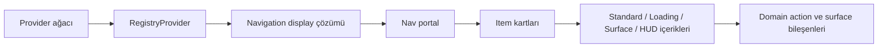
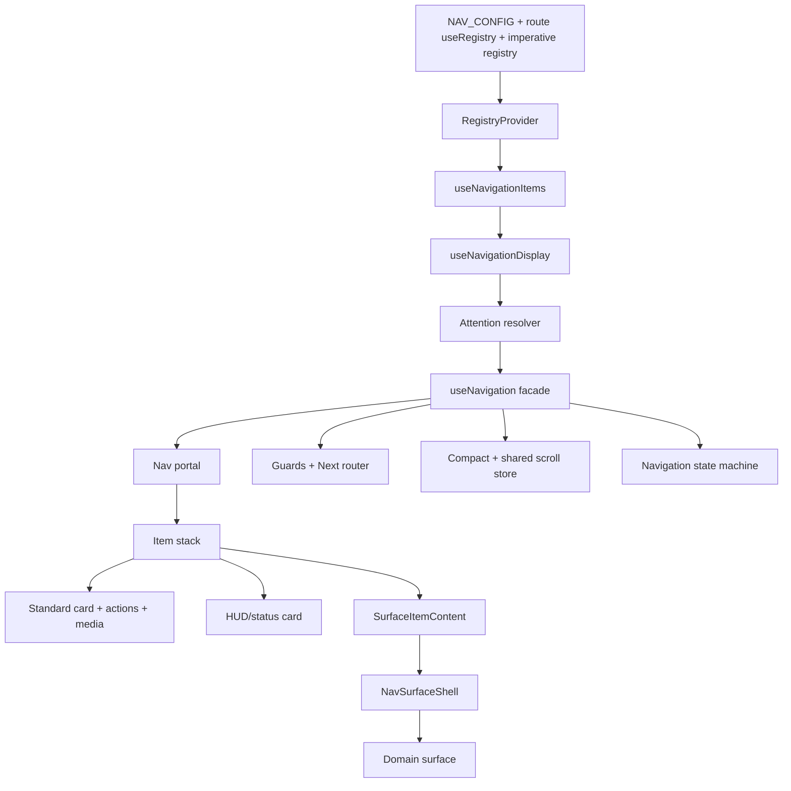

# Nav Modülü Teknik Dokümantasyonu

## 1. Kapsam

`Nav`, uygulamanın alt bölümünde portal üzerinden render edilen, rota ve registry durumuna göre içeriği değişen kart tabanlı navigasyon kabuğudur. Modül; rota kartlarını, compact/expanded görünümleri, surface stack'i, status kartlarını, HUD'ı, breadcrumb'ları, medya kontrollerini ve keyboard/outside-click/swipe etkileşimlerini aynı runtime içinde yönetir.

Bu belge implementasyondaki mevcut sözleşmeleri, veri akışını ve geliştirici arayüzlerini tanımlar.

## 2. Mimari

### 2.1 Katmanlar

| Katman | Sorumluluk |
| --- | --- |
| `app/providers.js` | Provider sırası, statik registry bootstrap'ı ve `Nav` dynamic import'ı |
| `modules/registry` | Kaynak, priority, instance ve snapshot çözümleme |
| `modules/nav` | Nav orkestrasyonu, görünüm, state, interaction, motion ve public API |
| `domains/shell/navigation` | Domain action, surface ve HUD implementasyonları |
| `background`, `loading`, `auth`, `modal`, `notification` | Nav'a veri veya davranış sağlayan çapraz modüller |



### 2.2 Provider ve client sınırı

`Nav`, `NavigationProvider` ve Nav hook'ları client component'tir. `app/providers.js` içinde `RegistryProvider` ve `NavigationProvider` sonrasında mount edilir. `Nav` için `next/dynamic` kullanılır; `document.body` portal hedefi bulunmadan `null` döner.

Route bileşenleri server component olabilir. Registry kaydı yapan bileşenler client component olmalıdır. Browser API'leri (`window`, `document`, `history`, `ResizeObserver`, `requestAnimationFrame`) effect veya client runtime yollarında kullanılır.

### 2.3 Veri akışı

```text
NAV_CONFIG / Registry kayıtları
        ↓
RegistryProvider: source + priority + instanceId
        ↓
useNavigationItems
        ↓
useNavigationDisplay: aktiflik ve attention çözümü
        ↓
useNavigation: core + compact + layout facade
        ↓
Nav: portal + backdrop + item stack
```

Aktif içerik için attention önceliği `surface` (400), status overlay (300 + priority), HUD (200 + priority), loading (100), normal status (75 + priority), route (0) sırasındadır. Aynı anda yalnızca en yüksek öncelikli içerik aktif kartta gösterilir.

## 3. Dosya ve public API haritası

### 3.1 Çekirdek modül

```text
modules/nav/
├── index.js                         # Nav root ve public barrel
├── context.js                       # NavigationProvider, state/actions context
├── navigation-state-machine.js      # Navigation/surface transition'ları
├── config.js                        # Route NAV config validator
├── item.js                          # Tek kart render pipeline'ı
├── actions.js                       # Toolbar action çözümleme ve render
├── elements.js                      # Icon, title, description atomları
├── layout.js                        # Geometri, ölçüm ve responsive genişlik
├── motion.js                        # Motion token, variant ve transition kaynağı
├── surface-model.js                 # Surface descriptor ve step çözümleme
├── surface.js                       # Surface header/shell ve swipe dismiss
├── hud-model.js / hud.js            # HUD descriptor ve render shell
├── attention-model.js               # HUD/status/loading/surface önceliği
├── scroll-progress.js               # Sayfa scroll ilerleme göstergesi
├── guards.js                        # Async navigation guard registry
├── breadcrumbs/                     # Breadcrumb provider, model ve UI
├── media/                           # Video controls, scrubber ve soundwave
└── hooks/                           # Core, display, compact, stack, status ve ölçüm hook'ları
```

`modules/nav/index.js` navigation context/action/state hook'larını, `useNavigation`'ı, context action ve HUD hook'larını, HUD model sabitlerini, attention çözümleyicilerini, breadcrumb API'sini, `NavHud`'ı, media bileşenlerini ve surface API'sini re-export eder. Guard API'si `registerGuard`, `useNavigationGuard`, `clearNavigationGuards` ve `getNavigationGuardCount` olarak sunulur.

### 3.2 Domain katmanı

```text
domains/shell/navigation/
├── actions/       # Account, movie, person, review, search ve not-found action'ları
├── surfaces/      # Surface factory ve içerik bileşenleri
└── huds/          # Selection, Progress ve ContextAction HUD preset'leri
```

`app/_shell/navigation-config.js` statik home/account kartlarını; `app/_shell/nav-runtime.js` guard confirmation surface factory'sini sağlar. `domains/*/ui/registry.js` dosyaları route-scoped registry config üretir.

## 4. Component ve registry sistemi

### 4.1 Component ağacı

```text
AppProviders
└── NavigationProvider
    └── Nav
        ├── Nav backdrop
        ├── NavBreadcrumbsCard (expanded + breadcrumb varsa)
        └── Item[]
            ├── LoadingItemContent
            ├── StandardItemContent
            │   ├── Icon / IconOverlay / Badge
            │   ├── Title / Description
            │   ├── NavActionsContainer
            │   └── route action veya NavMediaControls
            └── SurfaceItemContent
                └── NavSurfaceShell
                    ├── NavSurfaceHeader
                    └── domain surface component veya node
```

`Item` memoized bir component'tir. Her item için route prefetch, hover/focus state'i, içerik yüksekliği ölçümü, `AnimatePresence` key'i ve kart geometri değerleri hesaplanır. Loading, surface ve HUD içerikleri standard içerik yolundan ayrılır.

### 4.2 Registry türleri

| Tür | Çözümleme |
| --- | --- |
| `NAV` | Object değerleri düşükten yükseğe priority ile birleştirilir |
| `NAV_RUNTIME` | Runtime adapter object değerleri birleştirilir |
| `LOADING` | En yüksek priority kaydı kazanır |
| `BACKGROUND` | En yüksek priority kaydı kazanır |
| `MODAL` | En yüksek priority kaydı kazanır |
| `CONTEXT_MENU` | En yüksek priority kaydı kazanır |

Default source priority değerleri `static=100`, `dynamic=200`, `user=300`'dür. Açık `registry.priority` değeri bu default'u geçersiz kılar. Eşit priority için source rank ve `updatedAt` kullanılır. `useRegistry`, her component instance'ına `useId` tabanlı `instanceId` ekler; cleanup yalnızca ilgili instance kaydını kaldırır.

### 4.3 NAV merge sözleşmesi

`NAV` kayıtları top-level alanlarda son yüksek-priority değeri kullanır. `style` object'i için `card`, `icon`, `title` ve `description` alt alanları object olduğunda nested merge uygulanır. `actions`, `children`, `surface` ve `iconOverlay` gibi alanlarda array veya object değeri açıkça yeni kayıt tarafından değiştirilir; bu alanlar otomatik olarak birleştirilmez.

Route config'teki `registry` metadata'sı payload'dan ayrılır. `source`, `priority` ve `cleanupDelayMs` kayıt lifecycle'ını etkiler. NAV config validator; scalar tipleri, absolute route path'ini, action array'ini ve style object'ini denetler. Geçersiz config registry'ye yazılmaz ve diagnostic uyarı üretilir.

### 4.4 Route kayıtları

```jsx
'use client';

import { useRegistry } from '@/modules/registry';

export function ExampleNavRegistry() {
  useRegistry({
    nav: {
      path: '/example',
      title: 'Example',
      description: 'Example workspace',
      icon: 'solar:widget-bold',
      registry: {
        source: 'dynamic',
        priority: 200,
        cleanupDelayMs: 600,
      },
    },
  });
  return null;
}
```

`useRegistry` cleanup'i component lifecycle'ına bağlıdır. NAV ve loading cleanup gecikmeli olabilir; gecikmeli callback lifecycle token ile geçersizleştirilir ve unregister instance-scoped yapılır. Böylece hızlı route değişiminde yeni kayıt eski cleanup tarafından silinmez.

## 5. State ve interaction modeli

### 5.1 Navigation context

`NavigationProvider` iki context sunar:

- `useNavigationState`: `expanded`, `isCompact`, `compactLocked`, `searchQuery`, `navHeight`, `surfaceState`, `hud`, `selectionMode` ve context actions.
- `useNavigationActions`: expanded/compact state, surface stack, HUD, selection mode, context action, search query ve height setter'ları.

State action ve görünüm state'i ayrıldığı için yalnızca action tüketen bileşenler ilgili state değişikliklerinde yeniden render edilir.

### 5.2 State machine

`navigation-state-machine.js` adlandırılmış transition'lar sağlar:

| Event | Etki |
| --- | --- |
| `EXPAND` / `COLLAPSE` | Kart yığınının expanded durumunu değiştirir |
| `SET_COMPACT` | Compact görünümünü günceller |
| `OPEN_SURFACE` | Surface id ekler, expanded'ı kapatır, lifecycle'ı `opening` yapar |
| `SURFACE_MOUNTED` | Lifecycle'ı `open` yapar |
| `CLOSE_SURFACE` | Surface id çıkarır; son surface için `closing` durumuna geçer |
| `CLOSE_ALL_SURFACES` | Tüm surface id'lerini çıkarır |

`useSurfaceStack`, stack'te immutable metadata ve `payloadId` tutar. Component, node, props ve callback gibi domain payload'ları ref tabanlı payload registry'de tutulur; Promise resolver ve `onClose` callback map'leri de state dışındadır. React state'e render için gerekli metadata yazılır; `onClose` callback'leri kapanışta idempotent biçimde çağrılır.

### 5.3 Compact davranışı

Compact çözümlemesi şu koşullara bağlıdır:

- aktif kart olmalıdır;
- surface, overlay, loading, status, HUD veya search action aktif olmamalıdır;
- input, textarea, select, contenteditable veya textbox focus'unda compact etkinleşmez;
- oynayan video ve pointer idle durumu focused davranış üretir;
- aşağı scroll toplamı 88px ve scroll konumu 148px eşiğini geçtiğinde compact etkinleşir;
- 36px altına dönüşte veya yukarı scroll'da compact kapanır;
- scroll bottom-lock için 2px aktivasyon ve 40px release mesafeleri kullanılır;
- horizontal wheel gesture, 260ms boyunca compact activation'ı bastırır;
- toggle cooldown 300ms'dir.

Compact durumda ilk top-card click preview stack'i görünür kılar; ikinci click expanded görünümü açar. Kart başlığına `Click again to expand navigation` erişilebilirlik etiketi ve dotted underline affordance'ı eklenir. Surface açılışı sırasında `surface-opening` compact lock kullanılır.

### 5.4 Expanded interaction

Expanded durumda:

- backdrop ve outside click yığını kapatır;
- `Escape` expanded durumunu kapatır;
- `ArrowUp` ve `ArrowDown` focused index'i döngüsel olarak değiştirir;
- `Enter` focused route'a navigate eder;
- input, textarea, select, contenteditable, textbox, button, link, option ve combobox içinden gelen event'ler global navigation handler tarafından işlenmez;
- surface veya fullscreen state aktifken expanded açılmaz.

Kart wrapper'ı nested toolbar veya surface control içeriyorsa `role="group"` kullanır. İçeriksiz navigasyon kartları `role="button"` ve keyboard activation kullanır. Toolbar ve surface kontrolleri primitive `Button` bileşenleriyle render edilir.

### 5.5 Outside click ve fullscreen

`useClickOutside` Nav card stack ref'i üzerinde çalışır. Overlay kartları outside dismiss akışını engeller. Compact preview açıkken dış click yalnızca preview state'ini temizler. Fullscreen state aktive olduğunda expanded ve hover state'leri temizlenir.

## 6. Card stack, layout ve responsive davranış

`useNavigationLayout` aktif item'ı index 0'a alır, inactive loading item'larını kaldırır ve active path'in ancestor duplicate'larını filtreler. `/account` için username route segmentleri özel olarak ayrıştırılır. Expanded dışındaki render pipeline, compact durumda bir; normal collapsed durumda en fazla üç kart mount eder. Expanded durumda tüm filtrelenmiş item'lar render edilir.

`layout.js` kart width, height, y-offset, scale, opacity, viewport max height ve page spacer değerlerinin tek kaynağıdır. Desktop default width 460px, yatay genişletilebilir surface için üst sınır 640px'tir. Mobile width viewport'tan 16px, desktop width viewport'tan 32px marj bırakacak biçimde sınırlandırılır.

`useNavViewport` portal hedefini ve stack width'i sağlar. `useNavHeightController` `ResizeObserver` ölçümünü kart height ve `NavHeightSpacer` yüksekliğine dönüştürür. Height değişimleri 0.5px eşiğiyle filtrelenir. Viewport height değişince container height tekrar hesaplanır.

Breadcrumb kartı yalnız expanded durumda ve en az iki breadcrumb olduğunda görünür. En fazla dört tab gösterilir; ara tab'lar ellipsis ile kısaltılır.

## 7. Surface sistemi

### 7.1 Entry contract

`createSurfaceEntryDefinition` component veya node input'unu aşağıdaki internal entry'ye normalize eder:

```js
{
  renderMode: 'component' | 'node', component, content, props,
  action, showAction, dismissible, onClose,
  icon, title, description, descriptionMaxLines, trailing, headerAction,
  closeLabel, expandHorizontal, width, allowSwipeDismiss,
  steps, currentStepIndex, syncWithUrl, urlKey, badge,
}
```

`component`, `content/node/element` veya non-empty `steps` olmadan descriptor geçersizdir. `createInlineSurfaceEntry`, route registry'deki `surface` alanını aynı render contract'ına taşır. `resolveSurfaceAction` açık surface action'ını, `showAction` ayarını ve item action'ını sırasıyla çözer.

### 7.2 Stack ve Promise lifecycle

`openSurface(input, config)` geçerli bir entry için Promise döndürür. Surface compact durumdayken açılış callback'i 380ms scheduler ile geciktirilir; bu sırada `surface-opening` lock tutulur. Pending id, `closeSurface` veya `closeAllSurfaces` tarafından iptal edilebilir. Surface açıldığında stack'e eklenir ve lifecycle event'leri yayınlanır.

`closeSurface(result, targetSurfaceId)` en üst active/pending surface'i kapatır. `closeAllSurfaces(result)` active ve pending surface'leri tek işlemde kapatır. Kapanış sonucunda `onClose(result)` ve Promise resolver id başına en fazla bir kez çağrılır. Provider route değişiminde active/pending surface'ler `{ success: false, cancelled: true, reason: 'navigation' }` sonucu ile kapanır. Unmount sonucu `reason: 'unmount'` olur.

Surface stack aynı zamanda uygulama içi surface history olarak çalışır. Bir surface başka bir surface açıkken başlatılırsa yeni entry stack'in üzerine eklenir; aktif surface kapanınca alttaki surface tekrar görünür. `goBackSurface()` aktif entry'nin önceki step'i varsa o step'e döner, yoksa stack'te önceki bir surface bulunduğunda yalnızca aktif surface'i kapatır. Böylece Back ve Close farklı davranır: Back bir önceki navigation seviyesine döner, Close tüm surface stack'ini kapatır.

### 7.3 Çok adımlı surface

`steps` array'i component/content, props ve header alanlarını taşıyabilir. `pushStep`, `popStep` ve `goToStep` stack entry üzerinde `currentStepIndex` günceller. Aktif step çözümlemesi `stepIndex`, `totalSteps`, `canGoBack`, `isFirstStep` ve `isLastStep` bilgilerini üretir. Step header alanı root header alanını override eder; props root ve step object merge'iyle oluşturulur.

Surface component'e `close`, `closeAll`, `pushStep`, `popStep`, `goToStep`, step bilgileri ve descriptor props'u verilir.

### 7.4 Header ve swipe

`NavSurfaceShell`, `NavSurfaceHeader` ve `NavSurfaceHeaderButton` surface header public API'sidir. Header; icon, title, description, badge veya step indicator, trailing content, header action, back button ve close button taşıyabilir. Back button, header'ın sağındaki kontrol grubunda close button'ın hemen solunda görünür. Yalnızca önceki step veya önceki surface varsa render edilir. Surface child'ı `useSurfaceHeader()` ile root header state'ini güncelleyebilir. Shell, parent header prop değişikliklerini state'e senkronlar.

`allowSwipeDismiss` ve `onClose` mevcutsa vertical drag etkinleşir. Offset 65px veya velocity 400 eşiği aşıldığında close çağrılır. `dismissible=false` close control'ünü kaldırır; `allowSwipeDismiss=false` drag'i kapatır.

### 7.5 URL senkronizasyonu

`syncWithUrl` string veya `urlKey` verilirse surface değeri `?surface=<key>` ile senkronlanır. Açılış `pushState`, kapanış mevcut sahiplik doğrulanarak `replaceState` kullanır. Açılış öncesindeki `surface` değeri entry bazında saklanır; kapanışta yalnızca Nav'ın sahip olduğu değer geri alınır. `popstate`, aktif URL değeri beklenen key'den ayrıldığında surface stack'i `{ cancelled: true, reason: 'browser-back', success: false }` sonucu ile kapatır. URL hataları browser dışı ortamlarda yutulur.

### 7.6 Mevcut domain surface'leri

| Surface | İşlev |
| --- | --- |
| Account bio/social | Profil bilgisi, takip ilişkileri ve sosyal listeler |
| Confirmation | Guard, silme ve kritik işlem onayı |
| File upload | Dosya seçme, drag/drop ve upload callback'i |
| List create/editor/picker | Liste oluşturma, düzenleme, listeye item ekleme |
| MFA setup / verification | TOTP, re-authentication ve OTP doğrulama |
| Person bio | Kişi biyografisi ve genişletilmiş içerik |
| Review editor | Review veya liste yorumu oluşturma/düzenleme |
| Sign-in / sign-up | Email, OAuth, passkey ve verification auth akışları |
| Watch diary | İzlenme tarihi ve diary kaydı |
| Watch providers | Streaming, rent ve buy provider kategorileri |

## 8. HUD ve status sistemi

### 8.1 HUD model

`createHudDefinition` component, React node veya structured descriptor'ı normalize eder. Descriptor alanları `id`, `component`, `content/node/element`, `props`, `isActive`, `icon`, `title`, `description`, `badge`, `actions`, `progress`, `isIndeterminate`, `variant`, `priority`, `dismissOnNavigate`, `dismissOnEscape`, `autoDismissMs` ve `onCancel`'dır.

Variant'lar `COMPACT`, `EXPANDED`, `PROGRESS` ve `CUSTOM` değerleridir. Progress 0–100 aralığına clamp edilir; pozitif finite `autoDismissMs` kabul edilir. HUD öncelikleri `DEFAULT=0`, `CONTEXTUAL=10`, `MEDIA=15`, `SELECTION=20`, `TASK_PROGRESS=30`, `CRITICAL=50`'dir.

### 8.2 HUD lifecycle

`useNavHud` descriptor'ı register eder ve cleanup sağlar. `dismissOnNavigate` ve `dismissOnEscape` varsayılan olarak aktiftir. Escape `onCancel` çağırır ve HUD'ı temizler. `autoDismissMs` sonunda aynı cancel lifecycle'ı çalışır. Birden fazla active HUD arasından en yüksek priority seçilir.

`NavHudShell` structured veya custom content render eder. Compact variant action'ları header içinde; expanded variant action'ları alt satırda gösterir. Progress variant determinate `scaleX` veya indeterminate pulse bar kullanır.

### 8.3 Domain preset'leri

`domains/shell/navigation/huds/` altında `SelectionHud`, `ProgressHud` ve `ContextActionHud` preset'leri bulunur. Preset hook'ları `useNavHud` veya `useNavigationActions().setSelectionMode` üzerinden lifecycle'ı yönetir.

### 8.4 Status attention

`useNavigationStatus`, shared event'leri auth, API, application, network ve not-found status descriptor'larına dönüştürür. Status descriptor retry, sign-in, reload veya route action'ları taşıyabilir. `isOverlay=true` status, HUD ve loading'den yüksek attention priority alır; normal status route kartının içeriğini override eder.

## 9. Action ve media sistemi

### 9.1 Toolbar action çözümleme

`useNavActions` default notifications/logout action'larını, aktif item `actions` array'ini ve `useNavContextActions` ile kayıt edilen geçici action'ları birleştirir. Action'lar `visible !== false` filtresinden geçer ve `order` değerine göre sıralanır. `hideLogout` ve `hideScroll` filtreleri uygulanır. Status item'larında yalnız APP_ERROR ve API_ERROR action'ları gösterilir. Not-found, masked ve surface item'larında standard toolbar action'ları kapatılır.

`NavAction` tooltip, primitive button ve optional badge render eder. Action click event'i parent kart click'inden ayrılır.

```jsx
useNavContextActions([
  {
    key: 'refresh-data',
    icon: 'solar:refresh-bold',
    tooltip: 'Refresh',
    order: 10,
    onClick: refreshData,
  },
]);
```

### 9.2 Video controls

Aktif background video ve aktif route item birlikte bulunduğunda standard top card play/pause, 10 saniye geri/ileri, 1x/1.25x/1.5x/2x playback rate cycle, loop toggle, mute/unmute icon overlay ve üst kenarda interactive media scrubber sağlar.

`NavMediaScrubber`, video `currentTime` ve `duration` değerlerini animation frame ile takip eder; hover time tooltip ve click seek destekler. Normal video dışı durumda `NavScrollProgress`, ortak navigation scroll store üzerinden sayfa ilerleme oranını gösterir. `NavSoundwave`, medya oynatma sırasında domain action veya HUD içinde kullanılabilen görsel ses dalgasıdır. `formatMediaTime`, geçersiz değerleri `00:00` fallback'i ile `mm:ss` formatına çevirir.

## 10. Animation ve motion sistemi

Tüm Nav motion token'ları `modules/nav/motion.js` içinde merkezi tutulur. Uygulama `MotionConfig reducedMotion="user"` ile kullanıcı tercihini izler.

| Akış | Mekanizma |
| --- | --- |
| Stack width/height | `Nav` explicit animate object + shared panel spring |
| Card depth/scale/opacity | `Item` position tabanlı motion values |
| Expanded/compact content | `getNavCardContentAnimateProps` ve fade variants |
| Backdrop | `AnimatePresence` + backdrop variants |
| Surface enter/exit | `NavSurfaceShell` slide/fade variants |
| Surface compact açılışı | `NAV_COMPACT_TO_SURFACE_DELAY_MS = 380` |
| Surface close settle | `NAV_SURFACE_EXIT_SETTLE_MS = 520` fallback |
| Surface exit completion | `onAnimationComplete('exit')` compact lock release'i erken tamamlayabilir |
| Text/action/badge | Shared fade, stagger ve badge spring token'ları |
| Breadcrumb/HUD | Shared panel/fade variants |

Yeni duration veya easing literal'i eklenmemelidir. `layout` animation yerine explicit `y`, `scale`, `opacity`, `width` ve `height` değerleri kullanılır. Stable `contentKey` değerleri surface id ve HUD id üzerinden üretilir.

## 11. Extensibility ve geliştirici rehberi

### 11.1 Yeni route kartı

Statik route `NAV_CONFIG.items` içine eklenir ve `APP_REGISTRY_ENTRIES` üzerinden bootstrap edilir. Dinamik route `useRegistry({ nav: ... })` veya `useNavRegistryActions().register` kullanır. Temel alanlar `path`, `title`, `description`, `icon`, `style`, `actions`, `action`, `surface`, `width` ve `expandHorizontal`'dır.

### 11.2 Yeni action

- global action: `modules/nav/actions.js` default action listesine eklenir;
- route action: NAV config'te `action` veya `actions` kullanılır;
- geçici action: `useNavContextActions` kullanılır;
- surface action: `action` ve `showAction` entry alanları kullanılır.

Action bileşenleri event propagation'ı parent karttan ayırmalı ve primitive UI bileşenlerini kullanmalıdır.

### 11.3 Yeni HUD

Generic descriptor için `useNavHud` kullanılır. Tekrarlanan domain davranışları `domains/shell/navigation/huds/` altında preset hook/component olarak paketlenir. Yeni preset; `id`, priority, cancel, route cleanup ve Escape davranışını açıkça tanımlamalıdır.

### 11.4 Yeni surface

Factory named export ile entry üretmelidir. Surface component'i `close`, step API'leri ve custom props sözleşmesini kabul etmelidir. Header runtime'da değişiyorsa `useSurfaceHeader`; aynı surface içinde geri dönüş gerekiyorsa `popStep` veya `goToStep`; nested surface history davranışı gerekiyorsa `useNavigationActions().goBackSurface`; URL ile açılıp kapanması gerekiyorsa `syncWithUrl` veya `urlKey` kullanılmalıdır. Surface component'leri Back kontrolünü kendileri render etmemelidir; ortak header stack ve step durumuna göre kontrolü otomatik sağlar.

```jsx
import { useEffect } from 'react';
import { useNavigationActions, useSurfaceHeader } from '@/modules/nav';
import { Button } from '@/ui/primitives';

export function createExampleSurfaceEntry(data = {}, config = {}) {
  return {
    component: ExampleSurface,
    title: 'Example',
    icon: 'solar:widget-bold',
    props: { data },
    ...config,
  };
}

function ExampleSurface({ close, data }) {
  const setHeaderState = useSurfaceHeader();
  useEffect(() => {
    setHeaderState?.({ title: data.title || 'Example' });
  }, [data.title, setHeaderState]);

  return (
    <Button type="button" onClick={() => close({ success: true })}>
      Save
    </Button>
  );
}

export function ExampleLauncher({ data }) {
  const { openSurface } = useNavigationActions();
  return (
    <Button type="button" onClick={() => openSurface(createExampleSurfaceEntry(data))}>
      Open
    </Button>
  );
}
```

`useSurfaceHeader()` ile `setHeaderState` çağrısı effect veya event handler içinde yapılmalıdır; render sırasında state yazımı yapılmamalıdır. Component içinden `close`, `closeAll`, `pushStep`, `popStep` ve `goToStep` kullanılabilir.

### 11.5 Guard

```jsx
useNavigationGuard({
  when: isDirty,
  message: 'Unsaved changes will be lost. Continue?',
  onBlock: ({ to }) => logBlockedNavigation(to),
});
```

Guard'lar kayıt sırasıyla değerlendirilir. `when` sync veya async olabilir. İlk block sonucu `{ blocked: true, message, guardId }` döner. Guard evaluation error'ı navigation'ı bloklamaz ve console error olarak raporlanır. Cleanup callback'i registry'den kaydı kaldırır; test isolation için `clearNavigationGuards` kullanılabilir.

### 11.6 Navigation facade

Çoğu UI bileşeni için `useNavigation()` yeterlidir:

```jsx
const {
  activeItem,
  navigationItems,
  expanded,
  compact,
  searchQuery,
  setExpanded,
  setSearchQuery,
  navigate,
  openSurface,
  closeSurface,
} = useNavigation();
```

Router navigation guard-aware'dir. Başarılı route navigation expanded, search ve hover state'lerini temizler. Aynı path navigation başarısız sayılır ve route push yapılmaz.

### 11.7 Imperative surface akışı

```jsx
const result = await openSurface(createEditorSurfaceEntry({ media }));

if (result?.success) {
  invalidateMedia(media.id);
}
```

`result` uygulama tarafından serbestçe belirlenebilir. Cancel, navigation, browser-back ve unmount kapanışlarında `success=false` ve `cancelled=true` kullanılması standard lifecycle sözleşmesidir.

## 12. Test ve doğrulama

Nav contract testleri `tests/characterization/nav-*.test.js` altındadır. Kapsam; surface descriptor, inline surface action precedence, multi-step resolution, pending scheduler cancellation, guard order, HUD factory, media formatting, registry priority/merge, state machine ve config validator davranışlarını içerir.

Yerel doğrulama:

```bash
npm test
npm run lint
npm run build
git diff --check
```

Manuel browser matrisi:

1. collapsed → compact preview → expanded → route navigation,
2. Escape, outside click, ArrowUp/ArrowDown ve Enter,
3. compact surface open/close ve pending close,
4. multi-step back/forward/close, nested surface history ve Promise sonucu,
5. guard block/confirm/cancel ve browser Back,
6. pre-existing `surface` query param ownership,
7. nested toolbar action keyboard event'leri,
8. video play/pause/seek/rate/loop/mute,
9. mobile swipe dismiss, desktop width ve fullscreen,
10. reduced-motion tercihi.

## 13. Referans dosya grupları

| Grup | Dosyalar |
| --- | --- |
| Root/context | `modules/nav/index.js`, `context.js`, `navigation-state-machine.js` |
| Display/layout | `hooks/use-navigation.js`, `use-navigation-core.js`, `use-navigation-display.js`, `use-navigation-layout.js`, `layout.js` |
| Compact/scroll | `hooks/use-navigation-compact.js`, `hooks/use-navigation-scroll-store.js`, `scroll-progress.js` |
| Surface | `surface-model.js`, `surface.js`, `hooks/use-surface-stack.js` |
| HUD/status | `hud-model.js`, `hud.js`, `attention-model.js`, `hooks/use-navigation-status.js` |
| Interaction | `actions.js`, `hooks/use-nav-keyboard.js`, `hooks/use-nav-context-actions.js`, `guards.js` |
| Media | `media/nav-media-controls.js`, `media/nav-media-scrubber.js`, `media/nav-soundwave.js` |
| Registry | `modules/registry/store.js`, `context.js`, `use-registry.js`, `apply-config.js` |
| Shell/domain | `app/providers.js`, `app/_shell/navigation-config.js`, `app/_shell/nav-runtime.js`, `domains/shell/navigation/` |

## 14. Architecture summary


