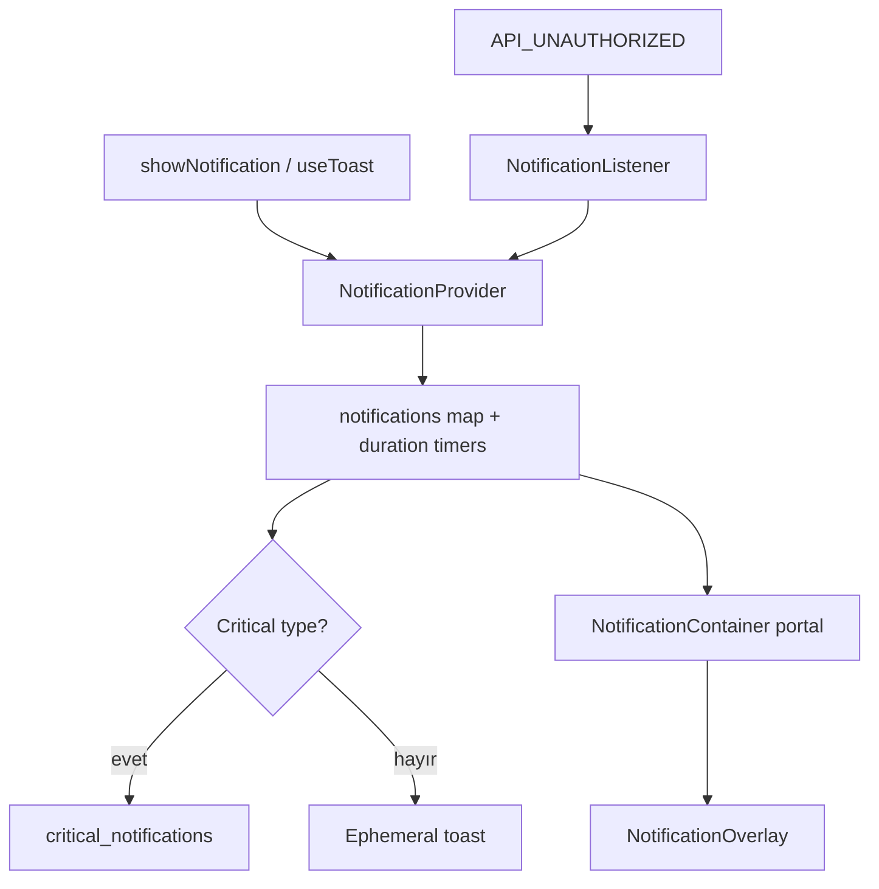

# Notification Modülü — Teknik Referans

> **İnceleme tarihi:** 28 Ağustos 2026
>
> `notification` modülü, kritik sistem bildirimleri ile kısa ömürlü toast'ları aynı state store'da tutar; kritik kayıtları browser storage'a persist eder, toast'ları portalda animasyonlu ve swipe edilebilir olarak gösterir.

## Hızlı özet

`NotificationProvider` notification map'i ve duration timer'larının sahibidir. `useToast` mesajları normalize eder, type'a göre default duration/dedupe id üretir ve production'da opsiyonel success/info gürültüsünü sınırlar. `NotificationContainer` tüm kayıtları timestamp sırasıyla body portalına taşır. `NotificationOverlay` tone/theme/icon/title/description/action sözleşmesini görsel karta çevirir.

## İçindekiler

1. [Dosya yapısı ve public API](#1-dosya-yapısı-ve-public-api)
2. [Notification type'ları](#2-notification-typeları)
3. [State ve persistence](#3-state-ve-persistence)
4. [Toast API ve dedupe](#4-toast-api-ve-dedupe)
5. [Render ve dismissal](#5-render-ve-dismissal)
6. [Event entegrasyonu](#6-event-entegrasyonu)
7. [Animasyon, performans ve riskler](#7-animasyon-performans-ve-riskler)
8. [Developer guide](#8-developer-guide)
9. [Final diagram](#9-final-diagram)

## 1. Dosya yapısı ve public API

| Dosya | Rol |
| --- | --- |
| `context.js` | Provider, critical/toast type sabitleri, show/dismiss action'ları. |
| `hooks.js` | `useToast`, default duration, production suppression ve feedback normalization. |
| `index.js` | `NotificationContainer`, global unauthorized listener ve public barrel. |
| `overlay.js` | Notification kartı, theme, close/action button render'ı. |
| `config.js` | Critical/toast type başlık, icon, semantic theme ve action tone config'i. |
| `client-utils.js` | Browser storage capability, get/set/remove wrapper'ları. |
| `motion.js` | Toast entrance/exit, drag ve micro interaction token'ları. |

## 2. Notification type'ları

### Critical

`PERMISSION_DENIED`, `SESSION_EXPIRED`, `SERVER_ERROR`, `OFFLINE` değerleri kalıcı/critical kanaldır. `OFFLINE` dismissible değildir; diğer default config'ler dismissible'dır. 404 mesajları critical map'e alınmaz.

### Toast

`SUCCESS`, `WARNING`, `ERROR`, `INFO` kısa ömürlü feedback türleridir. `NOTIFICATION_CONFIG` her type için tone, icon, title, semantic surface ve action tone class tanımlar.

## 3. State ve persistence

Provider state'i `{ notifications: { [id]: entry } }` biçimindedir. Entry `id`, `type`, `timestamp` ve caller data'sını taşır. `showNotification(type, data)` id olarak data id'sini, yoksa type'ı kullanır; aynı id için timer temizlenip kayıt yenilenir.

Yalnız valid critical notification'lar `critical_notifications` storage key'i ile persist edilir. Provider mount'ta storage okur, invalid veya 404 kayıtları filtreler; state değiştikçe critical subset'i tekrar yazar veya boşsa key'i siler. Toast'lar persistence filtresinden geçmediği için reload sonrası restore edilmez.

`duration` pozitif finite number ise timer kurulur. `dismissNotification(id)` timer'ı temizleyip map entry'sini siler. Provider unmount'ta tüm timer'lar temizlenir.

## 4. Toast API ve dedupe

```js
const { success, warning, error, info, show } = useToast();
success('Saved');       // 3000 ms
warning('Check input'); // 4000 ms
error('Request failed');// 4000 ms
info('Copied');         // 3000 ms
```

`useToast` message ve description'ı `normalizeFeedbackText` ile normalize eder. `action` tek item'ı, `actions` array'i çoklu action'ı ifade eder. Dedupe id sırası `dedupeKey`, explicit `id`, normalize message'ın ilk 50 karakteridir.

Boş mesajlar ve private profile mesajları gösterilmez. Production'da success/info default olarak gösterilmez; caller `allowInProduction: true` ile opt-in yapabilir. Warning/error production'da gösterilmeye devam eder.

## 5. Render ve dismissal

`NotificationContainer` portal target'ını mount sonrası `document.body` yapar. Sıralama timestamp ascending'dir. Container `aria-live="polite"`, `aria-atomic="true"` taşır.

Auto-dismiss olan ve dismissible notification'lar x ekseninde swipe edilebilir. Offset `>80` veya velocity `>300` olduğunda dismiss edilir. Auto-dismiss olmayan dismissible notification close button gösterir; action button varsayılan olarak action sonrası notification'ı kapatır, `dismiss: false` bunu engeller.

`NotificationOverlay` explicit title/message/description kombinasyonunu okunabilir iki satıra çözer; title ile description aynıysa description tekrar edilmez. Config icon/theme fallback'leri type veya tone üzerinden belirlenir.

## 6. Event entegrasyonu

`NotificationListener`, app kaynaklı veya source'u olmayan `API_UNAUTHORIZED` event'ini `SESSION_EXPIRED` critical notification'a çevirir. Auth modülü aynı event'te session temizleme yapabilir; iki modülün tepkileri birbirinden bağımsızdır.

`NotificationBadgeListener` public component olarak vardır ancak mevcut implementasyonda no-op döner; badge güncellemesi Nav tarafında ayrıca ele alınır.

## 7. Animasyon, performans ve riskler

- Toast girişinde `x:24, scale:.96 → x:0, scale:1`; çıkışta `x:64, scale:.95` kullanılır.
- Auto-dismiss swipe için drag elastic değeri sağ tarafta `0.7`, sol tarafta `0.05`'tir.
- Notification map ve timer ref'i küçük tutulur; yalnız critical subset storage'a yazılır.
- `showNotification` aynı id'yi yenilerken önceki timer'ı temizler; caller'ın stable dedupe id kullanması gerekir.
- Storage JSON/shape bozuksa invalid data temizlenir; storage erişim hataları client-utils tarafından güvenli biçimde yok sayılır.
- `aria-live` alanında çok sayıda kayıt aynı anda değişirse screen reader gürültüsü oluşabilir; action frequency ölçülmelidir.

## 8. Developer guide

Critical notification:

```jsx
const { showNotification } = useNotificationActions();
showNotification(CRITICAL_TYPES.SERVER_ERROR, {
  id: 'catalog-server-error',
  message: 'Catalog is unavailable',
  actions: [{ label: 'Retry', onClick: retry }],
});
```

Custom toast:

```jsx
toast.show(TOAST_TYPES.INFO, 'Copied to clipboard', {
  dedupeKey: 'copy-success',
  duration: 2500,
  allowInProduction: true,
});
```

Yeni notification type eklerken type set'i, config, storage validation ve public barrel export'larını birlikte güncelleyin. Critical kaydın reload sonrası kalıp kalmayacağını bilinçli seçin.

## 9. Final diagram


