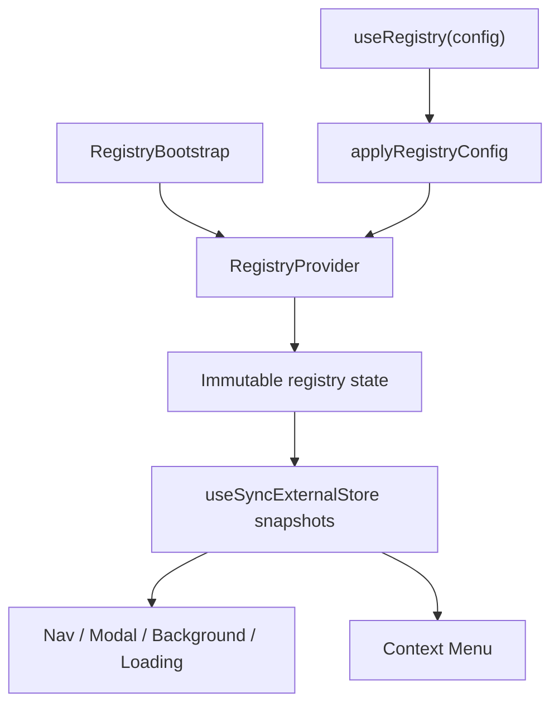
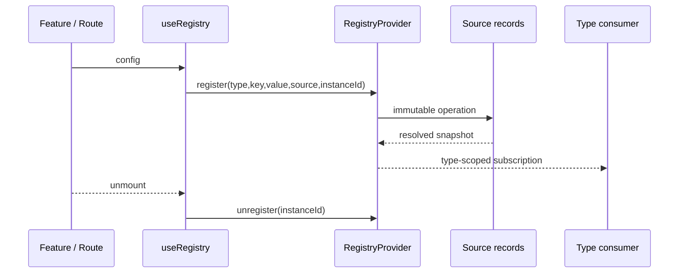

# Registry Modülü — Teknik Referans

> **İnceleme tarihi:** 28 Ağustos 2026
>
> `registry` modülü, farklı feature'ların React component lifecycle'ı boyunca runtime configuration kaydetmesini sağlayan immutable external store, source/priority resolver'ları ve `useSyncExternalStore` tabanlı selector'lar sunar.

## Hızlı özet

Registry altı type yönetir: `NAV`, `NAV_RUNTIME`, `MODAL`, `BACKGROUND`, `LOADING`, `CONTEXT_MENU`. Her key altında source + instanceId kayıtları tutulur. `NAV` ve `NAV_RUNTIME` shallow merge, diğer type'lar priority winner resolver kullanır. `useRegistry` declarative config'i lifecycle-safe register/unregister operasyonlarına çevirir.

## İçindekiler

1. [Mimari ve dosya yapısı](#1-mimari-ve-dosya-yapısı)
2. [Registry type ve resolver modeli](#2-registry-type-ve-resolver-modeli)
3. [Store record ve öncelik](#3-store-record-ve-öncelik)
4. [Provider ve subscription](#4-provider-ve-subscription)
5. [Declarative config plugin'leri](#5-declarative-config-pluginleri)
6. [Batch ve lifecycle](#6-batch-ve-lifecycle)
7. [Tüketici facade'leri](#7-tüketici-facade'leri)
8. [Performans ve riskler](#8-performans-ve-riskler)
9. [Developer guide](#9-developer-guide)
10. [Final diagram](#10-final-diagram)

## 1. Mimari ve dosya yapısı



| Dosya | Rol |
| --- | --- |
| `constants.js` | `REGISTRY_TYPES`, `REGISTRY_RESOLVERS`, source sabitleri. |
| `store.js` | Record normalize, priority compare, resolve, operation ve batch logic. |
| `context.js` | Provider, external store subscription ve type-specific facade'ler. |
| `use-registry.js` | Config stabilizasyonu, useId instanceId ve lifecycle apply/cleanup. |
| `apply-config.js` | title/nav/modal/background/loading/contextMenu plugin'leri. |
| `bootstrap.js` | Static entry'leri batch ile mount/unmount eder. |
| `route-registry.js` | Props'tan config çözen declarative component factory. |
| `index.js` | Public registry API. |

## 2. Registry type ve resolver modeli

| Type | Key örneği | Resolver | Tüketici |
| --- | --- | --- | --- |
| `NAV` | pathname | `merge` | `useNavRegistry`, Nav. |
| `NAV_RUNTIME` | `default` | `merge` | Nav runtime/guard/status. |
| `MODAL` | modal type | `priority` | `useModalRegistry`, Modal. |
| `BACKGROUND` | `page-background` | `priority` | BackgroundProvider. |
| `LOADING` | `page-loading` | `priority` | LoadingProvider. |
| `CONTEXT_MENU` | pathname, `*` | `priority` | Context menu engine. |

Geçerli olmayan type veya boş key operation'da etkisizdir. `DEFAULT_SOURCE` ve `DYNAMIC_SOURCE` değeri `dynamic`'dir.

## 3. Store record ve öncelik

Her source record şu alanları taşır:

`source`, `instanceId`, `priority`, `updatedAt`, `value`.

Default source priority'leri `static=100`, `dynamic=200`, `user=300`; source rank'leri aynı priority'de static 10, dynamic 20, user 30'dur. Son tie-break `updatedAt` değeridir. `instanceId`, aynı source'un iki React instance'ının birbirinin cleanup'ini silmesini önler.

`NAV` ve `NAV_RUNTIME` merge resolver'ında records düşükten yükseğe sıralanır ve object value'lar shallow spread edilir. Object olmayan merge value'su için son çözülen value kullanılır. Diğer type'larda karşılaştırmada en yüksek record kazanır.

`setSourceRecord` value/priority/source/instanceId değişmemişse yeni state üretmez. `removeSourceRecord` instanceId verilmişse yalnız o kaydı, verilmemişse source'un tüm instance kayıtlarını siler.

## 4. Provider ve subscription

`RegistryProvider` state'i `useRef` içinde tutar; her type için listener set'i vardır. `commitRegistries` yalnız değişen type listener'larını çağırır. `getSnapshot(type,key)` entry identity cache'i, `getEntriesSnapshot(type)` type registry identity cache'i kullanır.

Hook'lar:

- `useRegistryValue(type, key)`: tek resolved value.
- `useRegistryEntries(type)`: type altındaki tüm resolved entries.
- `useRegistryActions()`: generic register/unregister/batch.
- `useNavRegistryActions()`, `useModalRegistry()`, `useNavRegistry()`, `useNavRuntimeRegistry()`, `useContextMenuRegistry()`: type-specific facade'ler.

`useSyncExternalStore` snapshot'ları React render ve concurrent update davranışıyla uyumlu olacak şekilde subscribe edilir.

## 5. Declarative config plugin'leri

`useRegistry(config)` config'i recursive stabilize eder: function callback'leri stable wrapper'a alır, React node'ları clone eder, direct modal component path'lerini component olarak korur ve deep compare ile gereksiz re-apply'ı önler.

`applyRegistryConfig` plugin sırası:

1. `title`: `document.title`'ı değiştirir ve cleanup'te eski title'a döner.
2. `contextMenu`: pathname key'i ile context menu kaydeder.
3. `nav`: pathname/path key'i ile nav entry kaydeder.
4. `modal`: modal component map'ini batch kaydeder.
5. `background`: `page-background` kaydı.
6. `loading`: `page-loading` kaydı.

Her plugin hata yakalar; bir plugin failure'ı diğer plugin'lerin uygulanmasını engellemez. `registry` alt config'i source, priority ve cleanupDelayMs metadata'sı olarak ayrıştırılır.

## 6. Batch ve lifecycle

`batch(executor)` operation'ları aynı timestamp ile queue'lar, effective operation'ları sırayla hesaplar, tek commit yapar ve etkili operation sayısını döndürür. Bootstrap static entries ve modal/context menu type-specific batch facade'leri bunu kullanır.

`useRegistry` instance id'sini React `useId` üzerinden üretir. Mount/layout effect'te register, cleanup'te unregister çağrılır. Nav ve loading plugin'lerinde default cleanup delay **600 ms**dir; yeni aynı path/source/instance mount'ı eski timer'ı temizler. Bu gecikme hızlı route değişiminde flicker'ı azaltır.

`RegistryBootstrap` entries formatı `{ type, items, source?, options? }`'tır; mount'ta tüm item'lar, unmount'ta aynı instanceId ile kaldırılır.

## 7. Tüketici facade'leri

```jsx
const { register, unregister } = useNavRegistryActions();
register('/example', { path: '/example', title: 'Example' }, 'dynamic', { priority: 200 });
```

```jsx
useRegistry({
  nav: { path: '/example', title: 'Example', icon: 'solar:widget-bold' },
  loading: { isLoading: true, minDuration: 300 },
  background: { image: '/images/example.jpg' },
});
```

Nav `getAll`, runtime `default`, Modal `get` ve Context Menu `getAll` ile resolved snapshot tüketir; source record ayrıntısı consumer'a sızmaz.

## 8. Performans ve riskler

- External store + type-scoped listener, ilgisiz registry değişimlerinin render etkisini sınırlar.
- Entry/type identity cache'leri `useSyncExternalStore` için stabil snapshot sağlar.
- Batch tek commit ile çoklu registration churn'ünü azaltır.
- Config'teki inline function'lar stable wrapper ile effect re-run'larını azaltır; React component function'ları bilinçli olarak doğrudan korunur.
- NAV resolver shallow merge'dir; nested `style` veya `children` değerleri deep merge edilmez.
- Cleanup delay source/path/instance key'ine bağlıdır; custom source kullanan caller unregister semantiğini aynı source ile korumalıdır.
- Registry value içine büyük callback/data graph'ı koymak snapshot compare ve render maliyetini büyütebilir.
- Generic `register` invalid target'ı sessizce yok sayar; development validation katmanı teşhisi kolaylaştırabilir.

## 9. Developer guide

Yeni registry type ekleme:

1. `REGISTRY_TYPES` ve gerekiyorsa `REGISTRY_RESOLVERS` içine ekleyin.
2. `createInitialRegistries` default map'ini güncelleyin.
3. Type-specific plugin/facade gerekiyorsa context'e ekleyin.
4. `applyRegistryConfig` plugin'ini cleanup ve instanceId semantiğiyle yazın.
5. Public barrel, consumer ve dokümanları güncelleyin.

Yeni route component'i için `createRouteRegistry({ displayName, resolveConfig })` kullanın; component `resolveConfig(props)` sonucunu `useRegistry`'ye verir ve DOM render etmez.

## 10. Final diagram


